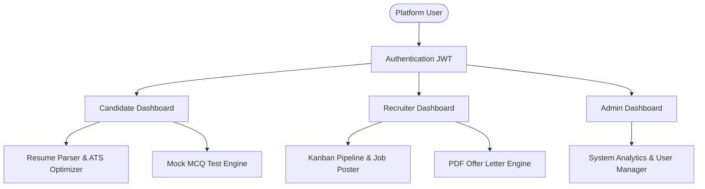

# CHAPTER 1: INTRODUCTION

## 1.1 Company Profile
**Anvistar ITS Pvt. Ltd.** is a premier software development and consulting services firm based in Aundh, Pune. Established with a vision to deliver cutting-edge technology solutions to global enterprises, the company specializes in artificial intelligence, full-stack application engineering, cloud solutions, and IT staff augmentation. Anvistar ITS designs high-reliability products that help organizations automate core operations. 

Operating under modern agile methodologies, Anvistar ITS Pvt. Ltd. provides hands-on mentorship to student interns, exposing them to enterprise-level practices including continuous integration/continuous deployment (CI/CD) pipelines, cloud database administration, automated QA testing, and secure API architectures. The platform **"HireMind AI"** was developed under the direct guidance of the senior technical team at Anvistar ITS as a proprietary human resources technology asset.

---

## 1.2 Project Profile
The **HireMind AI** platform is a full-stack, AI-powered recruitment management and career intelligence application. It bridges the gap between candidate qualifications and recruiter requirements by implementing automated screening pipelines, real-time resume parsing, ATS fit checks, personalized preparation, and structured applicant processing. 

| Project Element | Description |
| :--- | :--- |
| **Project Title** | HireMind AI – AI Powered Recruitment & Career Intelligence Platform |
| **Development Model** | Agile Iterative Development Model |
| **Architecture Type** | Three-Tier Architecture (Client-Server-Database) |
| **Key Users** | Candidates, Recruiters, and System Administrators |
| **Deployment Standard** | Cloud-ready containerized database & application services |

---

## 1.3 Existing System
In traditional corporate recruitment, candidate screening and interview preparation suffer from major inefficiencies:
*   **Manual Resume Review:** Recruiters spend hours scanning hundreds of resumes, leading to screening bottlenecks, inconsistencies, and cognitive fatigue.
*   **No Centralized ATS Engine:** Small-to-medium enterprises often rely on simple email threads and folder shares to manage candidates. Without structured ATS scoring, high-fit candidates are easily overlooked.
*   **Fragmented Job Portals:** Candidates must browse multiple external job sites, manual track their applications, and guess how well their skills match job requirements.
*   **Preparation Disconnect:** Job seekers lack custom assessment tools to practice for company-specific technical rounds, resulting in lower candidate readiness.
*   **Manual Onboarding Document Flow:** Constructing and sending offer letters, verifying candidate diplomas, and logging audit actions are handled through separate, disjointed platforms.

---

## 1.4 Scope of Project
The scope of **HireMind AI** includes:
*   **Role-Based Security:** Secure authentication with separate workspaces for Candidates, Recruiters, and Admins.
*   **Resume Analysis:** AI-based resume parsing, ATS scoring, and feedback generation.
*   **AI Career Assistance:** Automatically identifying candidate skill gaps, listing custom roadmaps, recommending resources, and drafting cover letters.
*   **Mock Practice Hub:** Generating custom MCQ tests based on role and target company to help candidates practice, with score calculations.
*   **External Scraping:** Aggregating external job listings from remote sites, using AI to structure the parsed listings.
*   **Recruitment Pipeline:** Interactive pipeline stages (Applied, Screened, Interview, Offered, Rejected), offer letter generators, and interview coordinators.
*   **Audit Logging:** Maintaining system logs of all critical actions.

---

## 1.5 Operating Environment

### Hardware Requirements
*   **Development / Client System:**
    *   Processor: Intel Core i5 or AMD Ryzen 5 (Minimum 2.4 GHz Clock speed)
    *   RAM: 8 GB (16 GB recommended for concurrent database, server, and client processes)
    *   Storage: 256 GB SSD (Solid State Drive)
*   **Production Deployment Server:**
    *   Virtual Compute: 1 vCPU (minimum), 1 GB RAM
    *   Storage: 10 GB SSD

### Software Requirements
*   **Operating System:** Windows 10/11, macOS, or Linux (Ubuntu 20.04 LTS+)
*   **Node.js Runtime:** Version 18.x or 20.x
*   **Database Management System:** PostgreSQL Relational Database
*   **Application Frameworks:** React (Vite environment), Express.js (REST server engine)
*   **ORM Layer:** Prisma Client ORM
*   **Development Tools:** Visual Studio Code, Git Command Line, Postman API Client, pgAdmin4

---

## 1.6 Technology & Tools Used
*   **React.js & Tailwind CSS:** Used to build a responsive, single-page application (SPA) with dark modes, dashboards, and charts.
*   **Node.js & Express.js:** Executes asynchronous backend operations, coordinates API endpoints, and enforces JWT validation.
*   **Prisma Client ORM:** Provides type-safe queries, database schema migration utilities, and manages relational mapping definitions.
*   **PostgreSQL:** Relational database for transaction logging, candidate histories, application pipelines, and profiles.
*   **Google Gemini AI (gemini-2.5-flash):** Drives core AI features, including resume parsing, skill matching, MCQ test generation, and JD structure enhancement.
*   **Cloudinary Storage:** Media hosting service for candidate resumes, university degree documents, and recruiter PDF offer letters.
*   **Cheerio & Node-Cron:** Runs background tasks to scrape job listings and parse text elements.

---

# CHAPTER 2: PROPOSED SYSTEM

## 2.1 Proposed System
The proposed system, **HireMind AI**, addresses the challenges of traditional hiring workflows by providing an integrated, AI-driven platform. It automates candidate screening and provides candidates with targeted career guidance, all within a single application.

By using role-based routing and a cloud-based relational database, the system ensures data access control: candidates focus on career development, recruiters manage candidate pipelines, and administrators monitor platform operations.

---

## 2.2 Modules of Proposed System

### 1. Authentication System
Provides secure login and registration with role-based routing (ADMIN, RECRUITER, CANDIDATE). It utilizes JSON Web Tokens (JWT) stored client-side for state validation, and uses bcrypt hashing to secure passwords in the database.

### 2. Candidate Dashboard
A workspace for job seekers displaying a summary of their metrics, including:
*   Active ATS profile score.
*   Uploaded resume name and link.
*   Total mock practice tests attempted.
*   Average test score.
*   Calculated profile completeness percentage.
*   Recent job recommendations and application statuses.

### 3. Recruiter Dashboard
A portal for hiring managers featuring:
*   Total active job postings.
*   Total received job applications.
*   Visual metrics charts showing applicant volume and stage distributions.
*   Shortcuts to create new jobs or access the Kanban applicant pipeline.

### 4. Admin Dashboard
An administration console allowing system admins to:
*   View global platform stats.
*   Manage, suspend, or reactivate user accounts.
*   Delete outdated job listings.
*   Inspect real-time system audit logs.

### 5. Resume Upload
Enables candidates to upload their resume in PDF format. Uploaded documents are saved to Cloudinary, with the file URL mapped to the candidate's profile.

### 6. Resume Parsing
Extracts structural text from uploaded resumes, parsing candidate contact info, educational history, work experience, and technical skills for evaluation.

### 7. ATS Score Engine
Compares candidate profiles against specific job descriptions to calculate an overall fit score (0-100%). It identifies missing key skills and highlights matches to help candidates optimize their resumes.

### 8. Job Matching Engine
Ranks available job openings against a candidate's profile using skill overlap, location preferences, and experience levels, suggesting high-fit listings.

### 9. Recruiter Analytics
Provides charts (using Recharts) to track key recruitment metrics, such as time-to-hire, application funnel conversion rates, and department-wise recruitment distribution.

### 10. AI Resume Analysis
Generates detailed qualitative evaluations of resumes using Gemini AI, outlining candidate strengths, weaknesses, and overall hiring recommendations.

### 11. AI Career Roadmap
Generates step-by-step career development plans tailored to a candidate's target job role, recommending specific technologies and soft skills to learn.

### 12. AI Resume Improver
Highlights weak bullet points in resumes and provides suggestions, suggesting action verbs and standard formatting to improve impact.

### 13. AI Skill Gap Analysis
Compares candidate skill profiles with job descriptions, identifying key missing competencies and recommending learning resources.

### 14. Mock Interview System
Dynamically generates custom mock tests based on a candidate's target role and company. It tracks candidate answers, calculates accuracy, and generates scorecards.

### 15. Interview Scheduler
Allows recruiters to schedule interviews by specifying dates, times, video meeting links, and interviewer notes. It updates application pipeline stages automatically.

### 16. Notification System
Sends in-app alerts to users, notifying candidates of interview invites or status updates, and notifying recruiters of new applications.

### 17. Email System
Sends automated email notifications for critical updates, including registration confirmations, interview scheduling details, and job offer links.

### 18. Candidate Ranking
Automatically ranks applicants for a job listing based on their ATS fit scores, helping recruiters quickly identify high-fit candidates.

### 19. Candidate Comparison
Provides recruiters with a side-by-side comparison interface of selected applicants, listing match scores, skill summaries, and key work histories.

### 20. Offer Letter Generator
Generates formal employment offer letters as PDFs using Node.js `pdfkit`. Letters are saved to Cloudinary and sent to candidates for download.

### 21. Resume History
Keeps a history of a candidate's uploaded resumes, allowing them to revert to previous versions or view progress over time.

### 22. External Job Aggregation
Aggregates job listings from external platforms (such as RemoteOK and Internshala) using background tasks, using Gemini AI to clean and structure the data.

### 23. Company Profile System
Allows recruiters to manage their company profiles, including name, logo, website, location, and description.

### 24. Saved Jobs
Enables candidates to bookmark job listings to view or apply to later.

### 25. Activity Logs
Maintains a log of system actions (e.g. user signups, resume uploads, job creations) for security and auditing purposes.

### 26. Export System
Allows candidates and recruiters to export data, such as scorecards, application summaries, and candidate profiles, as PDF files.

---

## 2.3 Objectives
*   **Improve Screening Efficiency:** Automate resume parsing and screening to reduce recruiter processing times.
*   **Provide Practical Career Support:** Offer candidates actionable feedback, including resume improvements, skill gap analyses, and mock test preparation.
*   **Integrate Data Management:** Centralize recruitment tasks—from scraping job listings to issuing formal offer letters—on a single platform.
*   **Maintain Access Controls:** Enforce clear role-based access permissions to protect candidate data and recruitment histories.
*   **Ensure Reliable Architecture:** Design a robust database structure using PostgreSQL and Prisma ORM to maintain data consistency.

---

## 2.4 Fact Finding Technique
To understand system requirements, we conducted fact-finding research:
1.  **Recruiter Interviews:** Discussed screening workflows with HR managers, identifying common bottlenecks like duplicate applications and manual resume parsing.
2.  **Candidate Surveys:** Surveyed MCA students and graduates to understand their challenges with job hunts, resume design, and interview preparation.
3.  **Analysis of Existing Portals:** Reviewed standard job boards, noting key limitations like the lack of feedback on resume screening.
4.  **Process Observation:** Observed manual recruitment workflows to identify opportunities for automation, such as candidate communication and document flow.

---

## 2.5 Feasibility Study

### Technical Feasibility
The platform utilizes React (Vite), Node.js, and PostgreSQL. These technologies are widely used and supported by extensive library ecosystems (such as Prisma ORM and Express.js). Integrating the Gemini AI API provides scalable parsing capabilities, confirming that the technical requirements of the platform are feasible.

### Operational Feasibility
The system features distinct dashboards for Candidates, Recruiters, and Admins. This separation provides user interfaces tailored to each role's specific workflows, making the application intuitive to operate.

### Economic Feasibility
The platform is built on open-source frameworks (React, Node.js, Express, PostgreSQL) and utilizes pay-as-you-go cloud services (Neon, Cloudinary, Gemini API). Automating screening workflows helps reduce administrative overhead, confirming the economic feasibility of the system.
