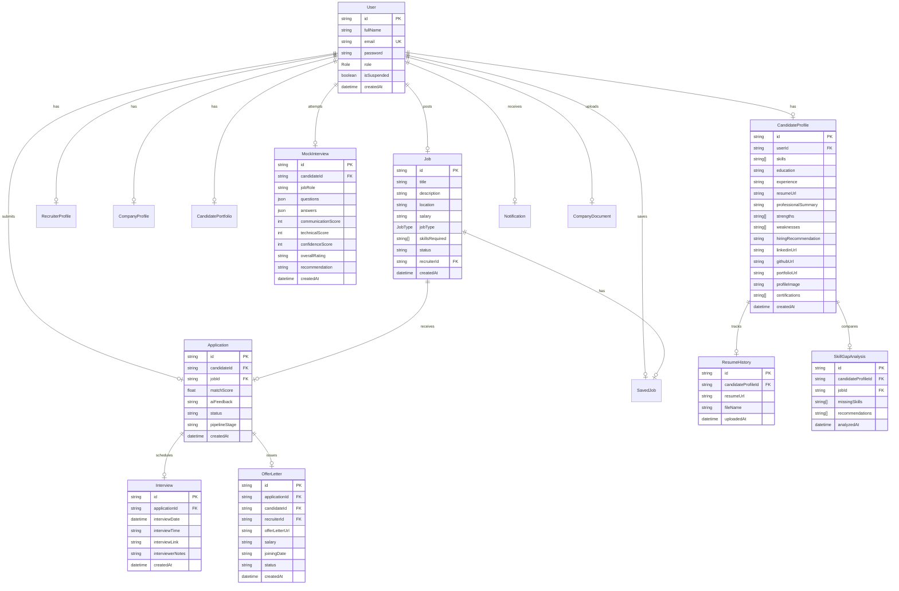
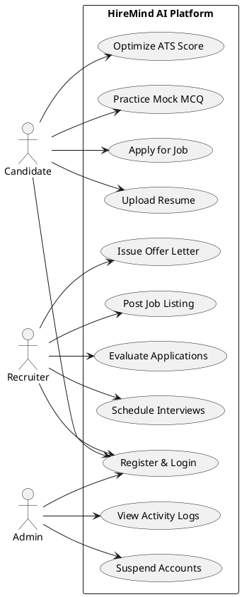
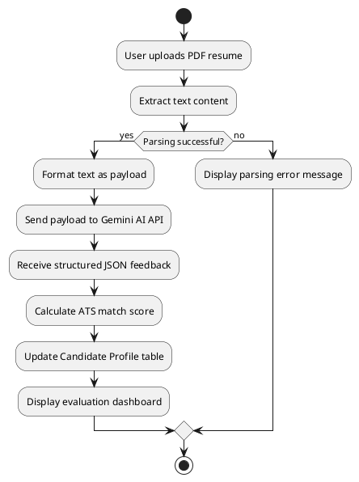
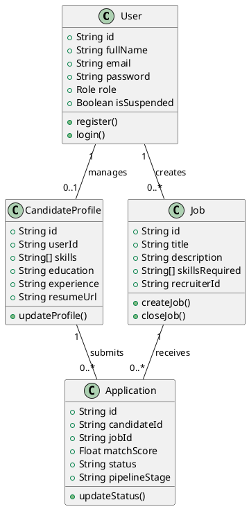
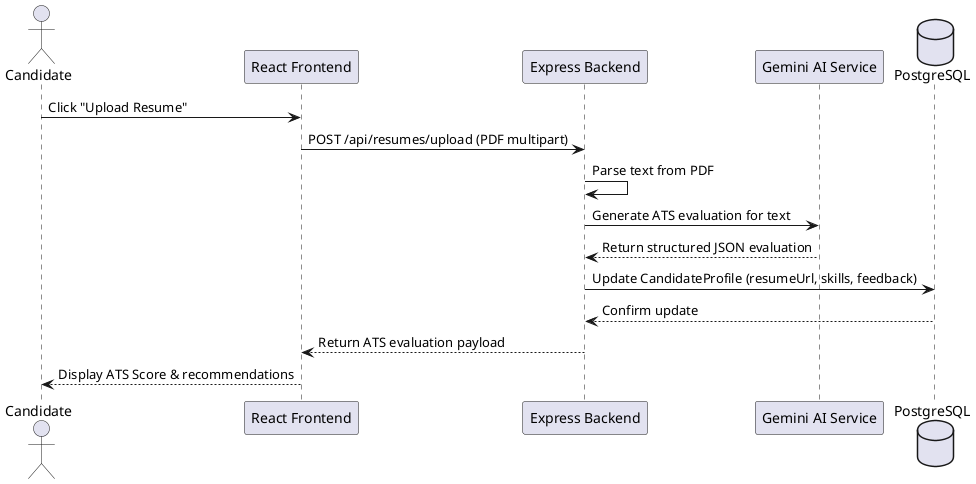
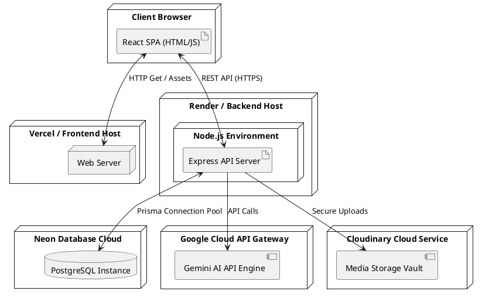
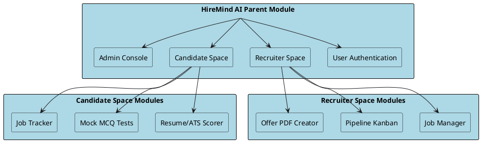

# CHAPTER 3: ANALYSIS AND DESIGN

## 3.1 Functional Requirements

### 1. User Management & Authorization
*   **Registration & Logins:** Candidates and recruiters must register using a unique email and secure password.
*   **Role Enforcement:** Users are assigned roles (`ADMIN`, `RECRUITER`, `CANDIDATE`). Access to routes, APIs, and pages is restricted based on these roles.
*   **Profile Editing:** Candidates can manage their profiles (including skills, education, and social links), and recruiters can manage their company information.

### 2. Resume & ATS Analysis
*   **Document Upload:** Candidates can upload PDF resumes, which are saved to Cloudinary.
*   **Parsing & Evaluation:** The system parses uploaded resumes and uses Gemini AI to analyze skills, compute compatibility scores, and identify key missing competencies relative to target job postings.

### 3. Job Search & Aggregation
*   **Job Posting:** Recruiters can create, edit, suspend, and close job postings.
*   **Application Pipeline:** Candidates can search for job listings, bookmark postings, and track their application statuses through pipeline stages (Applied, Screened, Interview, Offered, Rejected).
*   **Job Scraper:** A background job parser periodically aggregates job listings from external boards (RemoteOK, Internshala) and structures them using Gemini AI.

### 4. Interactive Interview & Onboarding
*   **Mock Practice Test Engine:** Candidates can take MCQ tests customized by target company and job role. The system evaluates answers and outputs scorecards.
*   **Interview Coordinator:** Recruiters can schedule interviews by providing date, time, meeting link, and notes.
*   **Offer Letter Generator:** Automatically generates formatted employment offer letters as PDFs for selected candidates.

---

## 3.2 Non-Functional Requirements

*   **Security:** Enforces passwords hashed with `bcrypt`, JWT signature validations, SSL database traffic, and role-based middleware routing.
*   **Reliability:** Implements standard connection pooling and keep-alive queries to ensure database accessibility under concurrent loads.
*   **Performance:** Aims for quick API response times for resume parsing and search queries, using index optimizations on frequently accessed database fields.
*   **Scalability:** Features a decoupled three-tier architecture (React client and Express REST server), allowing independent updates to the frontend and backend.
*   **Usability:** Standardized dashboard views for each user role, featuring responsive design for compatibility with both desktop and mobile layouts.

---

## 3.3 System Architecture

```
+-------------------------------------------------------------+
|                        Client Layer                         |
|                 React.js SPA (Vite) / Axios                 |
+------------------------------+------------------------------+
                               | API Requests (HTTPS)
                               v
+-------------------------------------------------------------+
|                      Application Layer                      |
|                  Node.js / Express Server                   |
+------------------+-----------+-----------+------------------+
                   |           |           |
                   | ORM       | REST API  | Media Upload
                   v           v           v
+------------------+---+  +----+----+  +---+------------------+
|    Data Layer    |  | AI Layer|  |    Storage Layer     |
|    PostgreSQL    |  |  Gemini |  |      Cloudinary      |
|   (Prisma ORM)   |  |   API   |  | (Resumes, PDFs, etc.)|
+----------------------+  +---------+  +----------------------+
```

### 1. Overall Architecture
A decoupled three-tier system: the client layer manages user interactions; the application layer handles business logic, security validations, and external integrations; and the data layer stores records and logs in PostgreSQL.

### 2. Frontend Architecture
Built as a Single Page Application (SPA) using React.js and Vite. It utilizes Tailwind CSS for styling and Recharts for dashboard analytics. State management and API communications are handled via Axios and standard React Context.

### 3. Backend Architecture
Built with Node.js and Express.js to process API requests. The backend validates JSON request payloads, manages authentication via JWT, runs scheduled background scrapers, and queries PostgreSQL using Prisma ORM.

### 4. Database Architecture
PostgreSQL hosted on Neon RDS. The database uses indexing on primary foreign keys and search criteria (such as candidate IDs, job IDs, and email fields) to optimize query performance, with Prisma managing schema updates.

### 5. AI Layer Architecture
Coordinates calls to the Gemini API (specifically using the `gemini-2.5-flash` model). It uses structured prompt inputs to ensure resume parsing, ATS evaluations, and mock test questions are returned as parseable JSON arrays.

---

## 3.4 Entity Relationship Diagram (ERD)



---

## 3.5 UML Diagrams

### 1. Use Case Diagram


### 2. Activity Diagram


### 3. Class Diagram


### 4. Sequence Diagram


### 5. Deployment Diagram


### 6. Module Hierarchy Diagram


---

## 3.6 Table Structure

### 1. User
Stores basic user credentials, roles, and status configuration.
*   `id` (String, PK, UUID)
*   `fullName` (String)
*   `email` (String, Unique)
*   `password` (String)
*   `role` (Enum: `ADMIN`, `RECRUITER`, `CANDIDATE`)
*   `isSuspended` (Boolean)
*   `createdAt` (DateTime)

### 2. CandidateProfile
Stores candidate profile data, social links, and AI resume analysis feedback.
*   `id` (String, PK, UUID)
*   `userId` (String, FK to User.id, Unique)
*   `skills` (String Array)
*   `education` (String)
*   `experience` (String)
*   `resumeUrl` (String)
*   `professionalSummary` (String)
*   `strengths` (String Array)
*   `weaknesses` (String Array)
*   `hiringRecommendation` (String)
*   `linkedinUrl` (String)
*   `githubUrl` (String)
*   `portfolioUrl` (String)
*   `profileImage` (String)
*   `certifications` (String Array)
*   `createdAt` (DateTime)

### 3. RecruiterProfile
Stores recruiter-specific information.
*   `id` (String, PK, UUID)
*   `userId` (String, FK to User.id, Unique)
*   `companyName` (String)
*   `companyLogo` (String)
*   `companyWebsite` (String)
*   `companyDescription` (String)
*   `industry` (String)
*   `companySize` (String)
*   `createdAt` (DateTime)

### 4. CompanyProfile
Stores detailed company information for public job board displays.
*   `id` (String, PK, CUID)
*   `recruiterId` (String, FK to User.id, Unique)
*   `companyName` (String)
*   `logo` (String)
*   `website` (String)
*   `industry` (String)
*   `teamSize` (String)
*   `about` (String)
*   `location` (String)
*   `founded` (String)

### 5. Job
Stores job postings created by recruiters.
*   `id` (String, PK, UUID)
*   `title` (String)
*   `description` (String)
*   `location` (String)
*   `salary` (String)
*   `jobType` (Enum: `FULL_TIME`, `PART_TIME`, `INTERNSHIP`, `CONTRACT`)
*   `skillsRequired` (String Array)
*   `status` (String, Default: "OPEN")
*   `recruiterId` (String, FK to User.id)
*   `createdAt` (DateTime)

### 6. Application
Tracks candidate job applications.
*   `id` (String, PK, UUID)
*   `candidateId` (String, FK to User.id)
*   `jobId` (String, FK to Job.id)
*   `matchScore` (Float)
*   `aiFeedback` (String)
*   `status` (String, Default: "APPLIED")
*   `pipelineStage` (String, Default: "Applied")
*   `createdAt` (DateTime)

### 7. Notification
Stores in-app alerts sent to users.
*   `id` (String, PK, UUID)
*   `userId` (String, FK to User.id)
*   `title` (String)
*   `message` (String)
*   `isRead` (Boolean)
*   `createdAt` (DateTime)

### 8. Interview
Stores detailed scheduled interview details.
*   `id` (String, PK, UUID)
*   `applicationId` (String, FK to Application.id)
*   `interviewDate` (DateTime)
*   `interviewTime` (String)
*   `interviewLink` (String)
*   `interviewerNotes` (String)
*   `createdAt` (DateTime)

### 9. SavedJob
Tracks jobs bookmarked by candidates.
*   `id` (String, PK, UUID)
*   `candidateId` (String, FK to User.id)
*   `jobId` (String, FK to Job.id)
*   `createdAt` (DateTime)

### 10. ResumeHistory
Logs historical resume uploads for a candidate.
*   `id` (String, PK, UUID)
*   `candidateProfileId` (String, FK to CandidateProfile.id)
*   `resumeUrl` (String)
*   `fileName` (String)
*   `uploadedAt` (DateTime)

### 11. OfferLetter
Stores issued employment agreements.
*   `id` (String, PK, UUID)
*   `applicationId` (String, FK to Application.id)
*   `candidateId` (String, FK to User.id)
*   `recruiterId` (String, FK to User.id)
*   `offerLetterUrl` (String)
*   `salary` (String)
*   `joiningDate` (String)
*   `status` (String)
*   `createdAt` (DateTime)

### 12. ExternalJob
Stores scraped job listings aggregated from external boards.
*   `id` (String, PK, UUID)
*   `title` (String)
*   `company` (String)
*   `location` (String)
*   `description` (String)
*   `skills` (String Array)
*   `salary` (String)
*   `applyUrl` (String)
*   `source` (String)
*   `sourceType` (String)
*   `postedDate` (DateTime)
*   `fetchedAt` (DateTime)
*   `isActive` (Boolean)
*   `summary` (String)
*   `requiredSkills` (String Array)
*   `experienceLevel` (String)
*   `category` (String)

### 13. ActivityLog
Tracks system events for audit logs.
*   `id` (String, PK, UUID)
*   `action` (String)
*   `details` (String)
*   `userId` (String)
*   `createdAt` (DateTime)

### 14. MockInterview
Stores candidate mock practice test results.
*   `id` (String, PK, CUID)
*   `candidateId` (String, FK to User.id)
*   `jobRole` (String)
*   `questions` (Json)
*   `answers` (Json)
*   `communicationScore` (Int)
*   `technicalScore` (Int)
*   `confidenceScore` (Int)
*   `overallRating` (String)
*   `recommendation` (String)
*   `createdAt` (DateTime)

### 15. SkillGapAnalysis
Logs analyzed skill gap assessments.
*   `id` (String, PK, UUID)
*   `candidateProfileId` (String, FK to CandidateProfile.id)
*   `jobId` (String, FK to Job.id)
*   `missingSkills` (String Array)
*   `recommendations` (String Array)
*   `analyzedAt` (DateTime)

---

## 3.7 Data Dictionary

This section outlines schema metrics for all 15 models stored within the PostgreSQL system.

### 1. User
| Field Name | Data Type | Key Type | Null? | Constraints | Description |
| :--- | :--- | :--- | :--- | :--- | :--- |
| `id` | VARCHAR(36) | PK | No | DEFAULT UUID | Unique identifier for each user |
| `fullName` | VARCHAR(128) | - | No | - | User's full display name |
| `email` | VARCHAR(128) | - | No | UNIQUE | Registered email address |
| `password` | VARCHAR(256) | - | No | - | Encrypted password hash |
| `role` | VARCHAR(16) | - | No | Enum values | User authorization level |
| `isSuspended`| BOOLEAN | - | No | DEFAULT false | Account suspension flag |
| `createdAt` | TIMESTAMP | - | No | DEFAULT now() | Date and time of registration |

### 2. CandidateProfile
| Field Name | Data Type | Key Type | Null? | Constraints | Description |
| :--- | :--- | :--- | :--- | :--- | :--- |
| `id` | VARCHAR(36) | PK | No | DEFAULT UUID | Unique identifier for the profile |
| `userId` | VARCHAR(36) | FK | No | UNIQUE, User(id) | Maps candidate profile to User table |
| `skills` | VARCHAR[] | - | Yes | - | Extracted technical skills list |
| `education` | TEXT | - | Yes | - | Candidate's academic details |
| `experience` | TEXT | - | Yes | - | Professional experience details |
| `resumeUrl` | VARCHAR(256) | - | Yes | - | URL to resume hosted on Cloudinary |
| `professionalSummary` | TEXT | - | Yes | - | Profile highlight narrative |
| `strengths` | VARCHAR[] | - | Yes | - | Key professional capabilities |
| `weaknesses` | VARCHAR[] | - | Yes | - | Areas suggested for growth |
| `hiringRecommendation` | TEXT | - | Yes | - | AI summary recommendation |
| `linkedinUrl` | VARCHAR(256) | - | Yes | - | Candidate's LinkedIn profile link |
| `githubUrl` | VARCHAR(256) | - | Yes | - | Candidate's GitHub profile link |
| `portfolioUrl` | VARCHAR(256) | - | Yes | - | Candidate's portfolio URL |
| `profileImage` | VARCHAR(256) | - | Yes | - | Path to profile photograph |
| `certifications` | VARCHAR[] | - | Yes | - | Extracted certifications array |
| `createdAt` | TIMESTAMP | - | No | DEFAULT now() | Profile creation timestamp |

### 3. RecruiterProfile
| Field Name | Data Type | Key Type | Null? | Constraints | Description |
| :--- | :--- | :--- | :--- | :--- | :--- |
| `id` | VARCHAR(36) | PK | No | DEFAULT UUID | Unique identifier for the recruiter |
| `userId` | VARCHAR(36) | FK | No | UNIQUE, User(id) | Link to User account |
| `companyName` | VARCHAR(128) | - | No | - | Active company name |
| `companyLogo` | VARCHAR(256) | - | Yes | - | Cloudinary URL for company logo |
| `companyWebsite` | VARCHAR(256) | - | Yes | - | URL to company official site |
| `companyDescription` | TEXT | - | Yes | - | Detailed company overview |
| `industry` | VARCHAR(128) | - | Yes | - | Industry sector categorization |
| `companySize` | VARCHAR(32) | - | Yes | - | Range showing team capacity |
| `createdAt` | TIMESTAMP | - | No | DEFAULT now() | Recruiter profile creation |

### 4. CompanyProfile
| Field Name | Data Type | Key Type | Null? | Constraints | Description |
| :--- | :--- | :--- | :--- | :--- | :--- |
| `id` | VARCHAR(30) | PK | No | DEFAULT CUID | Unique company page identifier |
| `recruiterId` | VARCHAR(36) | FK | No | UNIQUE, User(id) | Reference to initiating recruiter |
| `companyName` | VARCHAR(128) | - | No | - | Detailed company name |
| `logo` | VARCHAR(256) | - | Yes | - | Company logo URL |
| `website` | VARCHAR(256) | - | Yes | - | Company website address |
| `industry` | VARCHAR(128) | - | Yes | - | Domain field mapping |
| `teamSize` | VARCHAR(32) | - | Yes | - | Group headcount |
| `about` | TEXT | - | Yes | - | Public descriptions information |
| `location` | VARCHAR(128) | - | Yes | - | HQ city or coordinates |
| `founded` | VARCHAR(4) | - | Yes | - | Year of company establishment |

### 5. Job
| Field Name | Data Type | Key Type | Null? | Constraints | Description |
| :--- | :--- | :--- | :--- | :--- | :--- |
| `id` | VARCHAR(36) | PK | No | DEFAULT UUID | Unique job posting identifier |
| `title` | VARCHAR(128) | - | No | - | Title of the position |
| `description` | TEXT | - | No | - | Outline of duties & requirements |
| `location` | VARCHAR(128) | - | No | - | Job location designation |
| `salary` | VARCHAR(64) | - | Yes | - | Offered salary range |
| `jobType` | VARCHAR(16) | - | No | Enum values | Job type categorization |
| `skillsRequired` | VARCHAR[] | - | No | - | Required skills array |
| `status` | VARCHAR(16) | - | No | DEFAULT 'OPEN' | Posting status (OPEN, CLOSED) |
| `recruiterId` | VARCHAR(36) | FK | No | User(id) | Publisher identifier |
| `createdAt` | TIMESTAMP | - | No | DEFAULT now() | Date job listing was posted |

### 6. Application
| Field Name | Data Type | Key Type | Null? | Constraints | Description |
| :--- | :--- | :--- | :--- | :--- | :--- |
| `id` | VARCHAR(36) | PK | No | DEFAULT UUID | Application tracker identifier |
| `candidateId` | VARCHAR(36) | FK | No | User(id) | Applying candidate link |
| `jobId` | VARCHAR(36) | FK | No | Job(id) | Target job link |
| `matchScore` | FLOAT | - | Yes | - | Computed ATS fit score |
| `aiFeedback` | TEXT | - | Yes | - | Evaluative feedback from Gemini AI |
| `status` | VARCHAR(32) | - | No | DEFAULT 'APPLIED' | Application status |
| `pipelineStage` | VARCHAR(32) | - | No | DEFAULT 'Applied' | Stage of pipeline workflow |
| `createdAt` | TIMESTAMP | - | No | DEFAULT now() | Date application was submitted |

### 7. Notification
| Field Name | Data Type | Key Type | Null? | Constraints | Description |
| :--- | :--- | :--- | :--- | :--- | :--- |
| `id` | VARCHAR(36) | PK | No | DEFAULT UUID | Unique notification key |
| `userId` | VARCHAR(36) | FK | No | User(id) | Recipient key mapping |
| `title` | VARCHAR(128) | - | No | - | Header message summary |
| `message` | TEXT | - | No | - | Detailed alert message |
| `isRead` | BOOLEAN | - | No | DEFAULT false | Read/unread tracker |
| `createdAt` | TIMESTAMP | - | No | DEFAULT now() | Alert generation timestamp |

### 8. Interview
| Field Name | Data Type | Key Type | Null? | Constraints | Description |
| :--- | :--- | :--- | :--- | :--- | :--- |
| `id` | VARCHAR(36) | PK | No | DEFAULT UUID | Unique interview event key |
| `applicationId` | VARCHAR(36) | FK | No | Application(id) | Associated job application |
| `interviewDate` | TIMESTAMP | - | No | - | Scheduled interview date |
| `interviewTime` | VARCHAR(32) | - | No | - | Slotted time range |
| `interviewLink` | VARCHAR(256) | - | No | - | Video meeting room URL |
| `interviewerNotes` | TEXT | - | Yes | - | Preparation instructions |
| `createdAt` | TIMESTAMP | - | No | DEFAULT now() | Scheduling timestamp |

### 9. SavedJob
| Field Name | Data Type | Key Type | Null? | Constraints | Description |
| :--- | :--- | :--- | :--- | :--- | :--- |
| `id` | VARCHAR(36) | PK | No | DEFAULT UUID | Bookmark tracker key |
| `candidateId` | VARCHAR(36) | FK | No | User(id) | Link to candidate account |
| `jobId` | VARCHAR(36) | FK | No | Job(id) | Bookmarked job listing |
| `createdAt` | TIMESTAMP | - | No | DEFAULT now() | Date listing was bookmarked |

### 10. ResumeHistory
| Field Name | Data Type | Key Type | Null? | Constraints | Description |
| :--- | :--- | :--- | :--- | :--- | :--- |
| `id` | VARCHAR(36) | PK | No | DEFAULT UUID | History entry identifier |
| `candidateProfileId` | VARCHAR(36) | FK | No | CandidateProfile(id) | Associated candidate profile |
| `resumeUrl` | VARCHAR(256) | - | No | - | Historic resume link |
| `fileName` | VARCHAR(128) | - | No | - | Original uploaded filename |
| `uploadedAt` | TIMESTAMP | - | No | DEFAULT now() | Upload timestamp |

### 11. OfferLetter
| Field Name | Data Type | Key Type | Null? | Constraints | Description |
| :--- | :--- | :--- | :--- | :--- | :--- |
| `id` | VARCHAR(36) | PK | No | DEFAULT UUID | Offer letter transaction key |
| `applicationId` | VARCHAR(36) | FK | No | Application(id) | Target job application |
| `candidateId` | VARCHAR(36) | FK | No | User(id) | Receiving candidate |
| `recruiterId` | VARCHAR(36) | FK | No | User(id) | Initiating recruiter |
| `offerLetterUrl` | VARCHAR(256) | - | No | - | Offer PDF link on Cloudinary |
| `salary` | VARCHAR(64) | - | No | - | Offered remuneration |
| `joiningDate` | VARCHAR(32) | - | No | - | Scheduled starting date |
| `status` | VARCHAR(16) | - | No | - | Status (ISSUED, ACCEPTED) |
| `createdAt` | TIMESTAMP | - | No | DEFAULT now() | Issue timestamp |

### 12. ExternalJob
| Field Name | Data Type | Key Type | Null? | Constraints | Description |
| :--- | :--- | :--- | :--- | :--- | :--- |
| `id` | VARCHAR(36) | PK | No | DEFAULT UUID | Scraped listing key |
| `title` | VARCHAR(128) | - | No | - | Scraped job title |
| `company` | VARCHAR(128) | - | No | - | Name of recruiting company |
| `location` | VARCHAR(128) | - | No | - | Location designation |
| `description` | TEXT | - | No | - | Scraped job description text |
| `skills` | VARCHAR[] | - | Yes | - | Extracted skills tags |
| `salary` | VARCHAR(64) | - | Yes | - | Salary range details if any |
| `applyUrl` | TEXT | - | No | - | Redirection link for applying |
| `source` | VARCHAR(64) | - | No | - | Source domain |
| `sourceType` | VARCHAR(32) | - | No | - | Scraping method (RSS, WEB) |
| `postedDate` | TIMESTAMP | - | No | DEFAULT now() | Scraped posting timestamp |
| `fetchedAt` | TIMESTAMP | - | No | DEFAULT now() | Scraped download timestamp |
| `isActive` | BOOLEAN | - | No | DEFAULT true | Active status listing |
| `summary` | TEXT | - | Yes | - | AI summary description |
| `requiredSkills` | VARCHAR[] | - | Yes | - | Required skills array |
| `experienceLevel` | VARCHAR(32) | - | Yes | - | Experience level designation |
| `category` | VARCHAR(64) | - | Yes | - | Job category grouping |

### 13. ActivityLog
| Field Name | Data Type | Key Type | Null? | Constraints | Description |
| :--- | :--- | :--- | :--- | :--- | :--- |
| `id` | VARCHAR(36) | PK | No | DEFAULT UUID | Audit log entry key |
| `action` | VARCHAR(64) | - | No | - | Logged action name |
| `details` | TEXT | - | No | - | Description of the action |
| `userId` | VARCHAR(36) | - | No | - | Initiating user key |
| `createdAt` | TIMESTAMP | - | No | DEFAULT now() | Event logging timestamp |

### 14. MockInterview
| Field Name | Data Type | Key Type | Null? | Constraints | Description |
| :--- | :--- | :--- | :--- | :--- | :--- |
| `id` | VARCHAR(30) | PK | No | DEFAULT CUID | Test scorecard identifier |
| `candidateId` | VARCHAR(36) | FK | No | User(id) | Attempting candidate |
| `jobRole` | VARCHAR(64) | - | No | - | Target job role |
| `questions` | JSON | - | No | - | Generated questions array |
| `answers` | JSON | - | No | - | Candidate answers data |
| `communicationScore` | INT | - | No | - | Score indicating communication skill |
| `technicalScore` | INT | - | No | - | Score indicating technical skill |
| `confidenceScore` | INT | - | No | - | Score indicating confidence |
| `overallRating` | VARCHAR(32) | - | No | - | Overall assessment rating |
| `recommendation` | TEXT | - | No | - | Recommendations for improvement |
| `createdAt` | TIMESTAMP | - | No | DEFAULT now() | Test completion date |

### 15. SkillGapAnalysis
| Field Name | Data Type | Key Type | Null? | Constraints | Description |
| :--- | :--- | :--- | :--- | :--- | :--- |
| `id` | VARCHAR(36) | PK | No | DEFAULT UUID | Assessment record key |
| `candidateProfileId` | VARCHAR(36) | FK | No | CandidateProfile(id) | Associated candidate profile |
| `jobId` | VARCHAR(36) | FK | No | Job(id) | Target job posting |
| `missingSkills` | VARCHAR[] | - | No | - | List of missing key skills |
| `recommendations` | VARCHAR[] | - | No | - | Recommended study topics |
| `analyzedAt` | TIMESTAMP | - | No | DEFAULT now() | Date of analysis |

---

## 3.8 Sample Input Screens

### 1. User Registration / Signup Interface
*   **Fields:** Full Name, Email Address, Password, Confirm Password, Role Selector (Candidate or Recruiter).
*   **Actions:** "Submit Registration" (sends signup requests to the backend) and "Sign In Instead" (redirects users to the login screen).

### 2. Resume Document Uploader Page
*   **Fields:** Dropzone Area (supports PDF, Docx; file limit 5MB), Profile Photo Upload.
*   **Actions:** "Upload Resume" (transmits file payload to the server for processing) and "Revert File Changes" (clears the select list).

### 3. Interview Coordination Setup Form
*   **Fields:** Application ID (hidden value), Date Selector, Time Entry field, Video Meeting URL Link, Interviewer Instructions/Agenda text.
*   **Actions:** "Schedule Interview" (saves schedule details and advances pipeline stage) and "Cancel Setup".

---

## 3.9 Sample Output Screens

### 1. ATS Review Screen
*   **Content:** An analytical report featuring:
    *   Overall ATS Score Gauge (percentage indicator, e.g., 85%).
    *   Strengths (bullet points highlighting matching experience).
    *   Weaknesses (outlining missing skills or formatting issues).
    *   Hiring recommendation text (qualitative suitability assessment).

### 2. Recruiter Analytics Overview Dashboard
*   **Content:** Visually displaying recruitment metrics, including:
    *   Total Job Openings, Total Active Applications, and Total Interviews scheduled.
    *   Application Volume Chart (line graph displaying weekly submissions).
    *   Pipeline Status Chart (donut chart mapping candidates by stage: Screened, Interview, Offered).

### 3. Interactive MCQ Scorecard Summary
*   **Content:** Final test summaries featuring:
    *   Scores (Technical Score, Communication Score, Confidence Score).
    *   Review Grid (listing questions, candidate responses, and correct options).
    *   Feedback Analysis (identifying areas for technical improvement).

---

## 3.10 Reports

*   **Platform Audit Logging Reports:** Administrative logs detailing user registrations, resume uploads, and job additions.
*   **Candidate Application Progress Reports:** Candidate-facing logs tracking application history, active review statuses, and interview schedules.
*   **Recruiter Sourcing Funnel Reports:** Recruiter-facing summaries listing job postings, total views, application counts, and average candidate scores.
