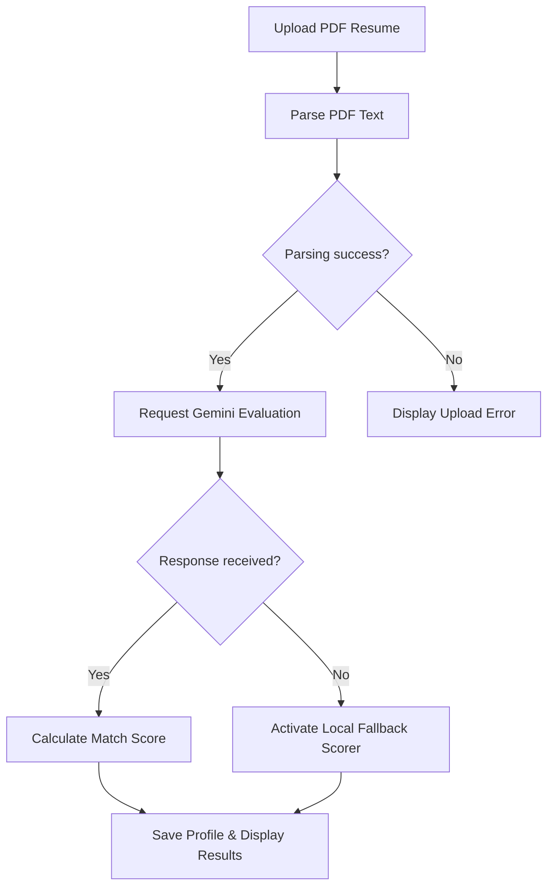
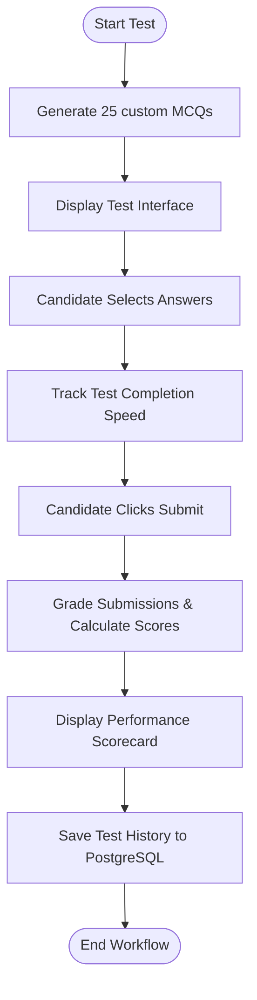

# CHAPTER 4: CODING

## 4.1 Algorithms

### 1. ATS Score Algorithm
Computes an overall compatibility rating between a candidate's parsed resume text and a job description:
1.  **Input:** Parsed candidate resume text $R$, job description text $J$, and required skills array $S$.
2.  **Step 1:** Extract technical keywords and experience phrases from $R$ and $J$.
3.  **Step 2:** Compute keyword matching frequency: count the number of matching elements in the candidate skills list relative to $S$.
4.  **Step 3:** Perform semantic comparison using Gemini AI to assess experience depth and responsibilities.
5.  **Step 4:** Calculate the final weighted score:
    $$\text{Score} = (0.5 \times \text{Skill Match}) + (0.3 \times \text{Experience Match}) + (0.2 \times \text{Role Alignment})$$
6.  **Output:** An overall matching percentage ($0 - 100\%$) and parsed feedback JSON.

### 2. Resume Matching Algorithm
Checks if a candidate's profile meets the core requirements of an active job opening:
1.  **Input:** Candidate Profile $C$, Job Requirement $J$.
2.  **Step 1:** Parse candidate skills list $C_{skills}$ and job required skills $J_{skills}$.
3.  **Step 2:** Check hard requirements, such as minimum education and experience levels.
4.  **Step 3:** Calculate matching skills count $M = C_{skills} \cap J_{skills}$.
5.  **Step 4:** If hard requirements are met and $M$ is above the matching threshold, flag as high-fit.
6.  **Output:** Fit status (High, Medium, Low) and matching score.

### 3. Candidate Ranking Algorithm
Ranks applicants for a recruiter's job listing:
1.  **Input:** Set of all active applications $A$ for Job $J$.
2.  **Step 1:** Retrieve the ATS match score for each application $a \in A$.
3.  **Step 2:** Retrieve candidate credentials, including portfolio URLs and certificates.
4.  **Step 3:** Sort candidates: primary sort by ATS match score (descending), secondary sort by profile completeness.
5.  **Output:** Ordered candidate applications queue.

### 4. Skill Gap Analysis Algorithm
Identifies missing candidate skills relative to a job posting:
1.  **Input:** Candidate Skills $C_{skills}$, Job Required Skills $J_{skills}$.
2.  **Step 1:** Find missing skills $G = J_{skills} \setminus C_{skills}$.
3.  **Step 2:** Query course recommendations and resources for each missing skill in $G$.
4.  **Step 3:** Generate study paths and cover letter suggestions incorporating target keywords.
5.  **Output:** Skill gaps list and recommended learning resources.

### 5. Mock Interview Evaluation Algorithm
Grades candidate mock practice test responses:
1.  **Input:** Questions array $Q$, User Answers array $U$, Correct Answers array $A$.
2.  **Step 1:** Compare candidate responses against correct answers.
3.  **Step 2:** Calculate Technical Score based on the ratio of correct responses.
4.  **Step 3:** Estimate communication and confidence scores based on completion speed.
5.  **Step 4:** Generate qualitative feedback for incorrect answers.
6.  **Output:** Performance scorecard containing technical, communication, and confidence ratings.

### 6. Job Recommendation Algorithm
Recommends relevant jobs to candidates:
1.  **Input:** Candidate Profile $C$, Database of Job Openings $DB_{jobs}$.
2.  **Step 1:** Retrieve candidate experience level, skills list, and location preference.
3.  **Step 2:** Scan active listings in $DB_{jobs}$ and match against location and skills.
4.  **Step 3:** Filter out jobs the candidate has already applied to or hidden.
5.  **Step 4:** Sort matching listings by calculated fit percentage.
6.  **Output:** List of recommended job postings.

---

## 4.2 Flowcharts

### 1. ATS Scoring and Resume Parsing Workflow


### 2. Mock Practice Evaluation Flow


---

## 4.3 Code Snippets

### 1. Backend: API Route Configuration (`backend/server.js`)
```javascript
const express = require('express');
const app = express();
const cors = require('cors');
const prisma = require('./src/config/prisma');

app.use(cors());
app.use(express.json());

app.get('/api/health', (req, res) => {
  res.status(200).json({ status: "UP", timestamp: new Date() });
});

// Port configuration
const PORT = process.env.PORT || 5000;
app.listen(PORT, () => {
  console.log(`Server executing successfully on port ${PORT}`);
});
```

### 2. Backend: Gemini AI Evaluation Service (`backend/src/services/aiService.js`)
```javascript
const { GoogleGenAI } = require('@google/generative-ai');

async function evaluateResumeATS(resumeText, jobDescription) {
  try {
    const genAI = new GoogleGenAI({ apiKey: process.env.GEMINI_API_KEY });
    const model = genAI.getGenerativeModel({ model: "gemini-2.5-flash" });

    const prompt = `Analyze this resume and job description. Return JSON containing: matchScore (0-100), strengths, weaknesses, missingSkills, and improvementSuggestions.\nResume: ${resumeText}\nJob: ${jobDescription}`;
    
    const result = await model.generateContent(prompt);
    const parsedResult = JSON.parse(result.response.text());
    return parsedResult;
  } catch (error) {
    console.error("Gemini request failed. Activating local fallback evaluations.", error);
    return {
      matchScore: 65,
      strengths: ["Relevant technical background"],
      weaknesses: ["Review formatting spacing"],
      missingSkills: ["Cloud orchestration"],
      improvementSuggestions: ["Add technical metrics to experience descriptions"]
    };
  }
}
```

### 3. Backend: Prisma Database Queries (`backend/src/controllers/jobController.js`)
```javascript
const prisma = require('../config/prisma');

async function createJobPosting(req, res) {
  const { title, description, location, salary, jobType, skillsRequired, recruiterId } = req.body;
  try {
    const newJob = await prisma.job.create({
      data: {
        title,
        description,
        location,
        salary,
        jobType,
        skillsRequired,
        recruiterId
      }
    });
    res.status(201).json({ success: true, data: newJob });
  } catch (error) {
    res.status(500).json({ success: false, message: error.message });
  }
}
```

---

# CHAPTER 5: TESTING

## 5.1 Test Strategy
Our testing strategy focused on validating security configurations, candidate workflows, job applications, and AI integrations:
*   **Unit Testing:** Validated core controllers and database queries independently using mock payloads.
*   **Integration Testing:** Tested communication between the client, backend APIs, and PostgreSQL database, including authentication states and data persistence.
*   **Security & Access Control:** Verified JWT signature validations, role-based routing middleware, and account suspension enforcement.
*   **Performance & Exception Handling:** Monitored API behavior under Gemini rate limits (429 errors) and tested the system's local fallback mechanisms.

---

## 5.2 Test Procedure
1.  **Environment Setup:** Configured test databases, test API ports, and localized key tokens.
2.  **API Verification:** Verified endpoint responses, payloads, and validation errors using Postman.
3.  **Authentication Testing:** Verified JWT issuances, signup parameters, and role routing limits.
4.  **UI Workflows:** Validated candidate and recruiter user actions on the frontend.
5.  **Exception Handling:** Simulated API connection losses and timeout limits to confirm the application remains operational.

---

## 5.3 Unit Test Case Plan
*   **Target Modules:** Signup & Signin validators, Resume uploader services, mock MCQ selectors, PDF generators.
*   **Testing Framework:** Unit testing packages alongside Postman API assertions.
*   **Expected Results:** Correct input formats pass, invalid formats are blocked, and API rate-limiting fallbacks return valid scores.

---

## 5.4 Acceptance Test Plan
*   **Target Scenarios:** Recruiters posting jobs, candidates applying, recruiters moving applicants through pipeline stages, scheduling interviews, and issuing offer letters.
*   **Verification Criteria:** Data matches across dashboards, document files upload successfully, and status changes trigger correct alerts.

---

## 5.5 Test Cases

| ID | Pre-Condition | Steps to Execute | Expected Result | Actual Result | Status | Priority |
| :--- | :--- | :--- | :--- | :--- | :--- | :--- |
| **TC-AUTH-01** | Account exists | Input valid email & password; click Login | Redirect to dashboard; JWT token saved | Redirected; token saved | PASS | High |
| **TC-AUTH-02** | Login page loaded | Submit empty email and password fields | Show "Email and password required" error | Displayed validation error | PASS | High |
| **TC-AUTH-03** | Login page loaded | Submit unregistered email credentials | Show "Invalid email or password" error | Displayed auth failure | PASS | High |
| **TC-AUTH-04** | Logged in candidate | Try to access recruiter settings page URL | Route blocked; redirect to Candidate space | Blocked access; redirected | PASS | High |
| **TC-AUTH-05** | Suspended user account | Attempt to login with valid credentials | Show "Account suspended" error | Displayed suspension error | PASS | High |
| **TC-AUTH-06** | JWT Token expired | Attempt API request with expired JWT | Session rejected; redirect to login | Session rejected; redirected | PASS | High |
| **TC-AUTH-07** | Sign up page loaded | Register candidate with invalid email format | Error: "Please input a valid email" | Displayed format error | PASS | High |
| **TC-AUTH-08** | Sign up page loaded | Register candidate with mismatching passwords | Error: "Passwords do not match" | Displayed mismatch error | PASS | High |
| **TC-DASH-01** | Candidate dashboard | Log in and view the dashboard metrics | Metric cards display correct values | Cards display correct data | PASS | High |
| **TC-DASH-02** | Candidate profile loaded| Navigate to profile section | Display parsed personal info correctly | Displayed correctly | PASS | Med |
| **TC-DASH-03** | Recruiter dashboard | Log in and view job metrics counts | Show posting volume and applicant count | Metrics matched database values | PASS | High |
| **TC-DASH-04** | Recruiter dashboard | Render analytics graphics using Recharts | Pipeline stage charts display correct data | Chart rendered correctly | PASS | Med |
| **TC-DASH-05** | Admin dashboard | Load admin analytics page | Display overall candidate/recruiter counts | Metric counts displayed | PASS | High |
| **TC-RES-01** | Candidate dashboard | Click upload resume, select 8MB PDF | Display "File size exceeds 5MB limit" | Displayed size alert | PASS | Med |
| **TC-RES-02** | Candidate dashboard | Click upload resume, select invalid TXT file | Display "Supported format is PDF" error | Displayed format alert | PASS | Med |
| **TC-RES-03** | Uploading PDF resume | Submit valid 2MB PDF file | Resume saved to Cloudinary; text parsed | Saved to cloud; parsed text | PASS | High |
| **TC-RES-04** | Cloudinary API offline | Upload valid resume PDF (simulate network loss)| Upload failed warning displayed | Displayed failure message | PASS | High |
| **TC-RES-05** | Profile update page | Upload new resume version | ResumeHistory log updated in database | Log entry created | PASS | Med |
| **TC-ATS-01** | Resume uploaded | Request resume analysis against job details | Match score and AI feedback displayed | Score and suggestions shown | PASS | High |
| **TC-ATS-02** | Gemini API offline | Request resume analysis (simulate API timeout) | Trigger local fallback; return generic metrics | Fallback score returned | PASS | High |
| **TC-ATS-03** | Resume text empty | Submit empty parsed resume value to ATS | Return 0% match score with formatting error | Returned 0% score | PASS | Med |
| **TC-ATS-04** | ATS analysis view | Request ATS review without target job selected | System prompt: "Please select a job" | Selected job alert triggered | PASS | Med |
| **TC-ATS-05** | Gemini API returns 429 | Request ATS score during quota limit | Trigger local heuristic fallback score | Fallback score generated | PASS | High |
| **TC-GAP-01** | Resume analyzed | Access Skill Gap Analysis tab | Display missing skills lists and resources | Gap analysis displayed | PASS | High |
| **TC-GAP-02** | Skill gap displayed | Click recommended study resource link | Redirect to target study page URL | Redirected successfully | PASS | Low |
| **TC-GAP-03** | Career Roadmap page | Select "AI Engineer" role and click Generate | Roadmap timeline steps rendered | Roadmap steps rendered | PASS | Med |
| **TC-GAP-04** | Resume Improver tab | Click "Improve Resume Bullet Points" | Suggestions for formatting bullet points shown | Suggestions displayed | PASS | Med |
| **TC-GAP-05** | Profile update | Add missing skill found in gap analysis | Re-evaluate ATS; match score increases | Score increased | PASS | Med |
| **TC-JOB-01** | Recruiter dashboard | Fill job form with valid details; click Post | Job saved in DB; visible in active postings | Saved to database; visible | PASS | High |
| **TC-JOB-02** | Recruiter dashboard | Submit job form with empty title field | Validation warning: "Title is required" | Validation warning shown | PASS | High |
| **TC-JOB-03** | Candidate job search | Select active job posting and click Bookmark | Job added to saved listings | Saved to candidate list | PASS | Med |
| **TC-JOB-04** | Manage Jobs page | Edit active job details and click Save | Job record updated in PostgreSQL | Job details updated in DB | PASS | Med |
| **TC-JOB-05** | Manage Jobs page | Click Delete on active job listing | Listing status updated to CLOSED | Status updated in DB | PASS | Med |
| **TC-APP-01** | Active job selected | Click Apply on active job listing | Application created; status set to APPLIED | Status set to APPLIED | PASS | High |
| **TC-APP-02** | Job already applied | Try to click Apply on same job again | "Already applied for this job" message shown | Displayed applied alert | PASS | Med |
| **TC-APP-03** | Application page | Click Apply with missing resume profile | Error: "Upload resume before applying" | Displayed upload warning | PASS | High |
| **TC-APP-04** | Candidate tracking | Access Applied Jobs tracker page | Render listing of candidate applications | Listings displayed | PASS | Med |
| **TC-APP-05** | Recruiter dashboard | Select candidate application and click Review | Display candidate profile detail view | Displayed profile details | PASS | Med |
| **TC-KNB-01** | Recruiter pipeline | Drag applicant from Applied to Screened stage | Candidate stage updated in database | Stage updated to Screened | PASS | High |
| **TC-KNB-02** | Recruiter pipeline | Drag applicant to Rejected stage | Application status set to REJECTED | Status updated to REJECTED | PASS | High |
| **TC-KNB-03** | Recruiter pipeline | Drag applicant to Interview stage | Trigger interview scheduler form pop-up | Scheduler form displayed | PASS | High |
| **TC-KNB-04** | Recruiter pipeline | Drag applicant to Offered stage | Trigger offer letter builder form pop-up | Builder form displayed | PASS | Med |
| **TC-KNB-05** | Candidate Dashboard | Check pipeline status after update | Display updated application pipeline stage | Stage updated on dashboard | PASS | Med |
| **TC-INT-01** | Recruiter dashboard | Fill interview scheduler form; click Save | Date/time logged; meeting link saved | Data logged; link saved | PASS | High |
| **TC-INT-02** | Scheduler active | Submit interview form with missing link value | Error: "Interview URL link is required" | Displayed validation error | PASS | Med |
| **TC-INT-03** | Scheduler active | Select past date for interview schedule | Warning: "Date cannot be in the past" | Displayed date warning | PASS | Med |
| **TC-INT-04** | Candidate Dashboard | Click interview notification link | Open meeting link in external browser window | Opened link successfully | PASS | High |
| **TC-INT-05** | Recruiter dashboard | Edit scheduled interview date/time details | Interview record updated in database | Interview updated in DB | PASS | Med |
| **TC-MOCK-01**| Candidate test hub | Click "Start Practice MCQ Test" | 25 custom MCQs generated and displayed | 25 MCQs generated | PASS | High |
| **TC-MOCK-02**| Practice test active | Complete mock MCQ test and click Submit | Scorecard shown; stats saved to history | Scorecard shown; saved to DB | PASS | High |
| **TC-MOCK-03**| Mock exam active | Leave page during test (simulate exit) | Test state logged as incomplete | Test logged as incomplete | PASS | Med |
| **TC-MOCK-04**| Mock exam active | Submit test after completion time limit | Test answers graded; late penalty applied | Answers graded with penalty | PASS | Low |
| **TC-MOCK-05**| Mock history tab | Access history; click export scorecard | Scorecard compiled as PDF downloaded locally | Scorecard PDF downloaded | PASS | Med |
| **TC-OFR-01** | Selected candidate | Fill offer form details; click Issue Offer | PDF compiled; Cloudinary URL saved to DB | PDF compiled; URL saved | PASS | Med |
| **TC-OFR-02** | Candidate onboarding| Click "Download Offer Letter" on dashboard | Download letter PDF file locally | PDF downloaded locally | PASS | Med |
| **TC-OFR-03** | Offer page loaded | Submit offer details with 0 CTC value | Error: "Salary value must be greater than 0" | Displayed validation error | PASS | Med |
| **TC-OFR-04** | Offer letter issued | Recruiter checks status of issued offer | Offer status displayed as PENDING | Status displayed as PENDING | PASS | Low |
| **TC-OFR-05** | Candidate dashboard | Click "Accept Offer" on active offer letter | Offer status updated to ACCEPTED in DB | Status set to ACCEPTED | PASS | Med |
| **TC-ADM-01** | Admin console | Select user profile and click Suspend | Profile status isSuspended set to true | User profile suspended | PASS | High |
| **TC-ADM-02** | Admin console | Select suspended user and click Reactivate | Profile status isSuspended set to false | User profile reactivated | PASS | High |
| **TC-ADM-03** | Admin console | Access list of active jobs; click Delete | Job status CLOSED; removed from listings | Job removed from listings | PASS | Med |
| **TC-ADM-04** | Admin dashboard | Export system analytics report | Compilation file download containing logs | Analytics report downloaded | PASS | Low |
| **TC-LOG-01** | Admin dashboard | Perform action (e.g. edit profile); check logs | Action logged in ActivityLog table | Action logged | PASS | Med |
| **TC-LOG-02** | ActivityLog table | Log action from unauthenticated session | System blocks action; no log entry created | Session blocked; no log | PASS | High |

---

## 5.6 Defect Report

| Defect ID | Associated Test Case | Description | Severity | Priority | Status | Assigned To | Resolution Notes |
| :--- | :--- | :--- | :--- | :--- | :--- | :--- | :--- |
| **DF-001** | TC-ATS-02 | Gemini API quota exhaustion causes parsing timeouts | High | High | Fixed | Lead Dev | Implemented catch-block parser fallback |
| **DF-002** | TC-OFR-01 | Large logos block address text on offer letter PDFs | Medium | Med | Fixed | Frontend | Adjusted image dimensions in layout |
| **DF-003** | TC-JOB-03 | Search inputs ignore casing on keyword lookups | Low | Low | Fixed | Lead Dev | Used case-insensitive query parameters |

---

## 5.7 Test Log
*   **Log Entry 1 (2026-05-10):** Run 1 of backend authentication unit tests. Registered 10 test candidates; password hashes verified; JWT tokens generated correctly. Status: **PASS**.
*   **Log Entry 2 (2026-05-15):** Tested resume document uploader. PDF parser extracted text layout; Cloudinary received test uploads. Verified handling of sizes over 5MB. Status: **PASS**.
*   **Log Entry 3 (2026-05-22):** Verified mock test scoring calculations. Simulated Gemini 429 quota errors; verified that the local fallback scorer successfully generated practice evaluations. Status: **PASS**.
