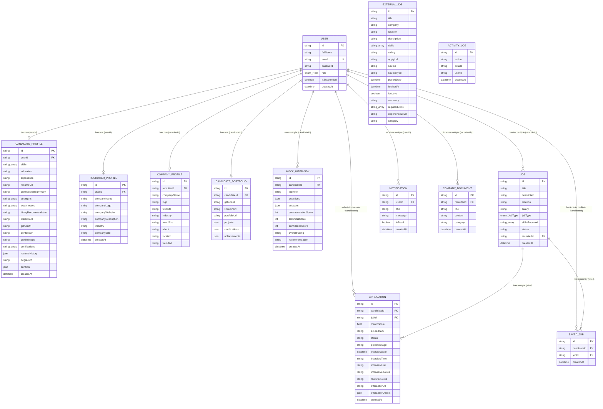

# Database Design: HireMind AI Platform

This document describes the schema design, tables, entity fields, constraints, data types, and primary-foreign key relationships mapped inside the PostgreSQL database for the **HireMind AI** platform.

---

## 1. Entity Relationship Diagram (ERD)

The database schema is mapped using **Prisma ORM** targeting **PostgreSQL**. The diagram represents all database entity definitions, primary/foreign keys, attributes, and cardinality constraints.

---

## 2. Database Data Dictionary

### 2.1. Table: User
Stores primary user identity records for authorization, authentication, and role allocation.

| Field Name | Data Type | Key Constraints | Default Value | Description |
| :--- | :--- | :--- | :--- | :--- |
| **id** | VARCHAR(36) | Primary Key (UUID) | Auto-generated | Unique identifier of the user record. |
| **fullName** | VARCHAR(255) | None | None | First name and last name of the user. |
| **email** | VARCHAR(255) | Unique Key | None | Electronic mail address (used for logging in). |
| **password** | VARCHAR(255) | None | None | Bcrypt-hashed password string. |
| **role** | ENUM("ADMIN", "RECRUITER", "CANDIDATE") | None | None | Role assigned for role-based permission gates. |
| **isSuspended** | BOOLEAN | None | FALSE | Flag to suspend users. If TRUE, JWT auth calls reject logins. |
| **createdAt** | TIMESTAMP | None | NOW() | Date-time stamp when the profile was generated. |

### 2.2. Table: CandidateProfile
Holds metadata specific to job seekers, including parsed resume attributes, credentials, and verification status.

| Field Name | Data Type | Key Constraints | Default Value | Description |
| :--- | :--- | :--- | :--- | :--- |
| **id** | VARCHAR(36) | Primary Key (UUID) | Auto-generated | Unique identifier for candidate meta. |
| **userId** | VARCHAR(36) | Foreign Key (Ref User.id) | None | Maps CandidateProfile back to User. |
| **skills** | VARCHAR(255)[] | Array Field | None | Array of parsed skill strings. |
| **education** | TEXT | None | None | Educational history (text paragraph). |
| **experience** | TEXT | None | None | Professional experience history details. |
| **resumeUrl** | VARCHAR(2048) | None | None | File path URI to current active resume file in Cloudinary. |
| **professionalSummary** | TEXT | None | None | Short bio or overview. |
| **strengths** | VARCHAR(255)[] | Array Field | None | AI-analyzed candidate strengths list. |
| **weaknesses** | VARCHAR(255)[] | Array Field | None | AI-analyzed candidate weaknesses list. |
| **hiringRecommendation** | TEXT | None | None | Overall suitability overview from ATS. |
| **linkedinUrl** | VARCHAR(2048) | None | None | Profile link. |
| **githubUrl** | VARCHAR(2048) | None | None | Profile link. |
| **portfolioUrl** | VARCHAR(2048) | None | None | Profile link. |
| **profileImage** | VARCHAR(2048) | None | None | Link to avatar image resource. |
| **certifications** | VARCHAR(255)[] | Array Field | None | Array of certification strings. |
| **resumeHistory** | JSON | JSON Field | None | Array of previously uploaded resume links for archiving. |
| **degreeUrl** | VARCHAR(2048) | None | None | Cloudinary link to candidate's verified university degree PDF. |
| **certUrls** | JSON | None | None | Array of objects storing course certificate names and Cloudinary links. |
| **createdAt** | TIMESTAMP | None | NOW() | Date profile details were created. |

### 2.3. Table: RecruiterProfile
Stores company affiliation information for recruiter users.

| Field Name | Data Type | Key Constraints | Default Value | Description |
| :--- | :--- | :--- | :--- | :--- |
| **id** | VARCHAR(36) | Primary Key (UUID) | Auto-generated | Unique identifier for recruiter profile. |
| **userId** | VARCHAR(36) | Foreign Key (Ref User.id) | None | Mapped to parent user record. |
| **companyName** | VARCHAR(255) | None | None | Name of the primary organization. |
| **companyLogo** | VARCHAR(2048) | None | None | URI to image asset. |
| **companyWebsite** | VARCHAR(2048) | None | None | Web URL. |
| **companyDescription** | TEXT | None | None | Summary of company services. |
| **industry** | VARCHAR(255) | None | None | Industry category tag (e.g. Fintech). |
| **companySize** | VARCHAR(50) | None | None | Staff count band. |
| **createdAt** | TIMESTAMP | None | NOW() | Profile creation date. |

### 2.4. Table: Job
Details active recruitment openings created by recruiters.

| Field Name | Data Type | Key Constraints | Default Value | Description |
| :--- | :--- | :--- | :--- | :--- |
| **id** | VARCHAR(36) | Primary Key (UUID) | Auto-generated | Unique ID for the job opening. |
| **title** | VARCHAR(255) | None | None | Job role title (e.g. Software Architect). |
| **description** | TEXT | None | None | Complete requirements write-up. |
| **location** | VARCHAR(255) | None | None | Work location (e.g., Remote, hybrid). |
| **salary** | VARCHAR(100) | None | None | Salary budget (e.g., "$120k - $140k"). |
| **jobType** | ENUM("FULL_TIME", "PART_TIME", "INTERNSHIP", "CONTRACT") | None | None | Standard employment structure classification. |
| **skillsRequired** | VARCHAR(255)[] | Array Field | None | Array of required skill keyword tags. |
| **status** | VARCHAR(50) | None | "OPEN" | Job status indicator ("OPEN", "PAUSED", "CLOSED"). |
| **recruiterId** | VARCHAR(36) | Foreign Key (Ref User.id) | None | Maps to the recruiter user who posted it. |
| **createdAt** | TIMESTAMP | None | NOW() | Date-time stamp when job was posted. |

### 2.5. Table: Application
Captures job-seeker applications to jobs, including pipeline tracker stages, interview schedules, and generated employment offers.

| Field Name | Data Type | Key Constraints | Default Value | Description |
| :--- | :--- | :--- | :--- | :--- |
| **id** | VARCHAR(36) | Primary Key (UUID) | Auto-generated | Unique application record identifier. |
| **candidateId** | VARCHAR(36) | Foreign Key (Ref User.id) | None | Maps to candidate user applicant. |
| **jobId** | VARCHAR(36) | Foreign Key (Ref Job.id) | None | Mapped to target job posting. |
| **matchScore** | DOUBLE PRECISION | None | None | Fit percentage calculated by Gemini AI. |
| **aiFeedback** | TEXT | None | None | Text explanation of suitability generated by AI. |
| **status** | VARCHAR(50) | None | "APPLIED" | Main application status. |
| **pipelineStage** | VARCHAR(50) | None | "Applied" | Kanban board stage ("Applied", "Reviewing", "Shortlisted", "Interview", "Selected", "Rejected"). |
| **interviewDate** | TIMESTAMP | None | None | Scheduled calendar date for interview. |
| **interviewTime** | VARCHAR(50) | None | None | Scheduled calendar time for interview. |
| **interviewLink** | VARCHAR(2048) | None | None | Video conference link (e.g., Zoom/Google Meet). |
| **interviewerNotes** | TEXT | None | None | Internal preparation notes for recruiter. |
| **recruiterNotes** | TEXT | None | None | Additional notes/feedback from recruiters. |
| **offerLetterUrl** | VARCHAR(2048) | None | None | Cloudinary URL to issued employment offer letter PDF. |
| **offerLetterDetails** | JSON | None | None | Object containing salary details, joining dates, and employment clauses. |
| **createdAt** | TIMESTAMP | None | NOW() | Application submission date. |

### 2.6. Table: MockInterview
Saves simulation feedback parameters for candidate mock interview practices.

| Field Name | Data Type | Key Constraints | Default Value | Description |
| :--- | :--- | :--- | :--- | :--- |
| **id** | VARCHAR(191) | Primary Key (CUID) | Auto-generated | CUID format interview record identifier. |
| **candidateId** | VARCHAR(36) | Foreign Key (Ref User.id) | None | Mapped to candidate practicing. |
| **jobRole** | VARCHAR(255) | None | None | Job role evaluated (e.g., Python Developer). |
| **questions** | JSON | None | None | Array of questions asked. |
| **answers** | JSON | None | None | Array of text answers submitted by user. |
| **communicationScore**| INT | None | None | Communication assessment score (0 - 100). |
| **technicalScore** | INT | None | None | Technical competency score (0 - 100). |
| **confidenceScore** | INT | None | None | Overall confidence score (0 - 100). |
| **overallRating** | VARCHAR(100) | None | None | General band rating (e.g., "Advanced"). |
| **recommendation** | TEXT | None | None | Gemini-generated actionable feedback paragraph. |
| **createdAt** | TIMESTAMP | None | NOW() | Date-time stamp of mock session. |

### 2.7. Table: ExternalJob
Stores jobs aggregated from remote platforms (RemoteOK, Internshala, Telegram) via cron scheduler routines.

| Field Name | Data Type | Key Constraints | Default Value | Description |
| :--- | :--- | :--- | :--- | :--- |
| **id** | VARCHAR(36) | Primary Key (UUID) | Auto-generated | Unique external job identifier. |
| **title** | VARCHAR(255) | None | None | Job title. |
| **company** | VARCHAR(255) | None | None | Employer company name. |
| **location** | VARCHAR(255) | None | None | Geographical/remote scope. |
| **description** | TEXT | None | None | Full job description. |
| **skills** | VARCHAR(255)[] | Array Field | None | Array of parsed tags from source feed. |
| **salary** | VARCHAR(100) | None | None | Stipend or wage estimate range. |
| **applyUrl** | VARCHAR(2048) | None | None | External application redirect hyperlink. |
| **source** | VARCHAR(255) | None | None | Source site identifier (e.g., "RemoteOK"). |
| **sourceType** | VARCHAR(50) | None | None | Category classification ("RSS", "WEB", "TELEGRAM"). |
| **postedDate** | TIMESTAMP | None | NOW() | Original posting date-time. |
| **fetchedAt** | TIMESTAMP | None | NOW() | Sync transaction time. |
| **isActive** | BOOLEAN | None | TRUE | Active status toggle. |
| **summary** | TEXT | None | None | AI generated two-sentence summary. |
| **requiredSkills**| VARCHAR(255)[] | Array Field | None | AI extracted specific skill tags. |
| **experienceLevel**| VARCHAR(50) | None | "Mid" | AI classified band ("Entry", "Mid", "Senior", "Lead"). |
| **category** | VARCHAR(100) | None | "Other" | AI classified domain ("Frontend", "Backend", "Fullstack", etc.). |

### 2.8. Table: ActivityLog
Captures all critical operations performed on the platform to maintain secure audit logs.

| Field Name | Data Type | Key Constraints | Default Value | Description |
| :--- | :--- | :--- | :--- | :--- |
| **id** | VARCHAR(36) | Primary Key (UUID) | Auto-generated | Audit entry unique ID. |
| **action** | VARCHAR(255) | None | None | Type of action ("JOB_CREATED", "JOB_UPDATED", "RESUME_UPLOADED", "APPLICATION_SUBMITTED", "INTERVIEW_SCHEDULED", "OFFER_LETTER_GENERATED", "CREDENTIALS_UPLOADED"). |
| **details** | TEXT | None | None | Detailed textual audit description parameters. |
| **userId** | VARCHAR(36) | None | None | UUID of user who performed the operation. |
| **createdAt** | TIMESTAMP | None | NOW() | Event date-time stamp. |
