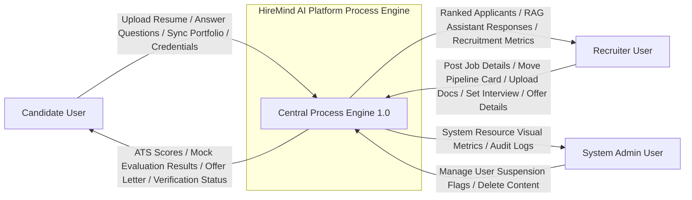
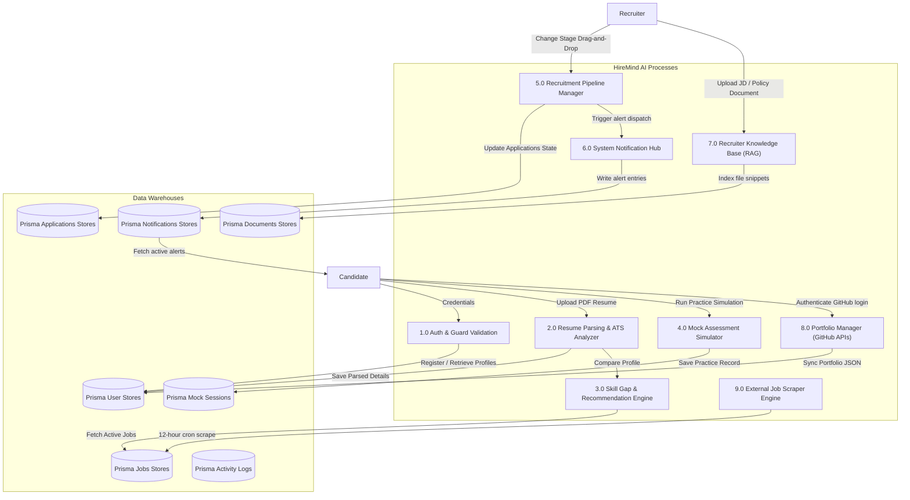

# Project Architecture: HireMind AI Platform

This document describes the high-level software architecture, data flows, use cases, and deployment diagrams of the **HireMind AI** recruitment intelligence platform.

---

## 1. System Architecture Diagram

The HireMind AI system utilizes a modern **Three-Tier Client-Server Architecture** coupled with external SaaS integration layers:

```mermaid
graph TD
    subgraph Client_Layer ["Client Presentation Layer (React + Tailwind CSS)"]
        A["Single Page Application (Vite/React)"]
        B["Auth Route Guards (JWT)"]
        C["UI Core Dashboard Component Controller"]
    end

    subgraph Controller_Layer ["Application & Controller Layer (Node.js + Express.js)"]
        D["Express Routing Engine"]
        E["Authentication Middleware (JWT verification & Role-based guards)"]
        F["Business Logic Controllers"]
        G["Prisma Client Engine Integration"]
    end

    subgraph Data_Storage_Layer ["Data Storage & Services Layer (PostgreSQL)"]
        H[("PostgreSQL Database Engine (Neon RDS Instance)")]
    end

    subgraph Service_Integrations ["External API Services Integration"]
        I["Google Gemini 2.5 Flash AI Service (JSON-Schema Mode)"]
        J["Cloudinary Cloud Media Assets Upload Hosting"]
        K["GitHub GraphQL/REST Public Developer API Services"]
    end

    A -->|1. Route Render Request| B
    B -->|2. Secure Auth Verification| C
    C -->|3. API Request (HTTPS & Bearer JWT Token)| D
    D -->|4. Middleware Session Verification| E
    E -->|5. Hand-off Controller Call| F
    F -->|6. Query Executions| G
    G -->|7. Data Reads/Writes| H
    F -->|8. Analysis & Mock Interview Queries| I
    F -->|9. PDF/Resume Assets Storage| J
    C -->|10. Read Portfolio GitHub Statistics| K
```

---

## 2. Use Case Diagrams

The platform supports three distinct user roles (Actors): Candidate, Recruiter, and Admin.

```mermaid
graph TD
    subgraph Act ["System User Actors"]
        U_Cand["Candidate User"]
        U_Recr["Recruiter User"]
        U_Admin["Admin User"]
    end

    subgraph UC_Candidate ["Candidate Use Cases"]
        UC1["Upload & Parse Resume"]
        UC2["Analyze ATS Score Profile"]
        UC3["Analyze Job Skill Gap"]
        UC4["Run AI Mock Interview Session"]
        UC5["Export PDF Mock Report"]
        UC6["Sync GitHub Portfolio Widgets"]
        UC7["Bookmark / Save Job Cards"]
        UC8["Submit Job Application"]
        UC20["Upload Degree & Certificates"]
        UC21["Download Employment Offer Letter"]
    end

    subgraph UC_Recruiter ["Recruiter Use Cases"]
        UC9["Post / Close Jobs"]
        UC10["Manage Kanban Pipeline Stages"]
        UC11["Perform AI Applicant Ranking"]
        UC12["Schedule Candidates for Interviews"]
        UC13["Update Public Company Profile"]
        UC14["Query RAG Assistant Documents"]
        UC22["Generate Official Offer Letter PDF"]
        UC23["Verify Candidate Education Credentials"]
    end

    subgraph UC_Admin ["Admin Use Cases"]
        UC15["Suspend / Activate User Accounts"]
        UC16["Delete Job Postings"]
        UC17["Track Platform Analytics KPIs"]
        UC24["Audit System Activity Logs"]
    end

    U_Cand --> UC1
    U_Cand --> UC2
    U_Cand --> UC3
    U_Cand --> UC4
    U_Cand --> UC5
    U_Cand --> UC6
    U_Cand --> UC7
    U_Cand --> UC8
    U_Cand --> UC20
    U_Cand --> UC21

    U_Recr --> UC9
    U_Recr --> UC10
    U_Recr --> UC11
    U_Recr --> UC12
    U_Recr --> UC13
    U_Recr --> UC14
    U_Recr --> UC22
    U_Recr --> UC23

    U_Admin --> UC15
    U_Admin --> UC16
    U_Admin --> UC17
    U_Admin --> UC24
```



---

## 3. Data Flow Diagrams (DFD)

### DFD Level 0 (Context Diagram)

The Level 0 context diagram shows the core information interfaces between the external actors and the boundary of the centralized HireMind AI Platform:



### DFD Level 1 (Process Breakdown Diagram)

The Level 1 diagram breaks the platform process boundary down into major sub-processes:



---

## 4. Deployment Diagram

This physical deployment diagram maps the cloud architecture nodes housing the platform:

```mermaid
graph TD
    subgraph Client_Browser_Node ["User Device Context"]
        Browser["Web Browser (Chrome, Safari, Firefox, Edge)"]
        ReactApp["React Frontend Static Assets (HTML5, JS Bundle, Tailwind)"]
        Browser --> ReactApp
    end

    subgraph CDN_Edge_Nodes ["Static CDN hosting Edge network"]
        VercelCDN["Vercel Static Hosting Platform Server Nodes"]
    end

    subgraph Backend_App_Node ["Application Backend Node"]
        ExpressApp["Node.js / Express Web Server Running Environment"]
        PrismaORM["Prisma Database Connector Engine"]
        ExpressApp --> PrismaORM
    end

    subgraph Database_Cloud_Node ["Cloud Database Server Cluster"]
        PostgresNode[("Neon cloud hosted PostgreSQL Instance")]
    end

    subgraph Service_Cloud_Nodes ["External Third Party Services Cloud Nodes"]
        GeminiNodes["Google Cloud Gemini Pro Service Infrastructure"]
        CloudinaryNodes["Cloudinary Asset Storage Server Networks"]
    end

    ReactApp -->|Fetch/REST requests| VercelCDN
    ReactApp -->|API Calls (HTTPS / Port 443)| ExpressApp
    PrismaORM -->|Connection Pooling TCP/IP / Port 5432| PostgresNode
    ExpressApp -->|HTTPS / Port 443| GeminiNodes
    ExpressApp -->|HTTPS / Port 443| CloudinaryNodes
```
