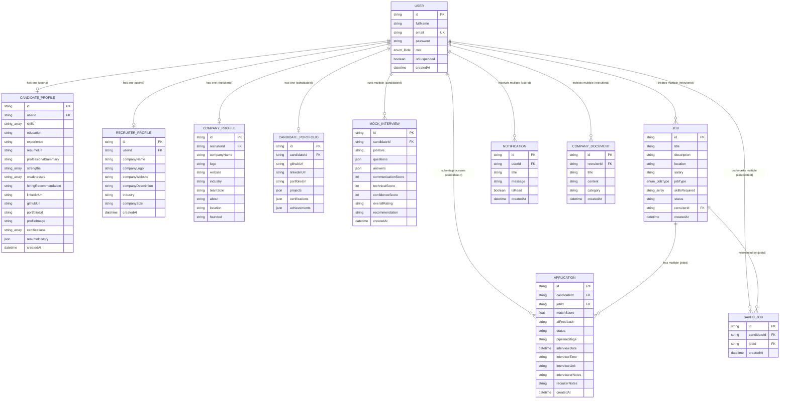
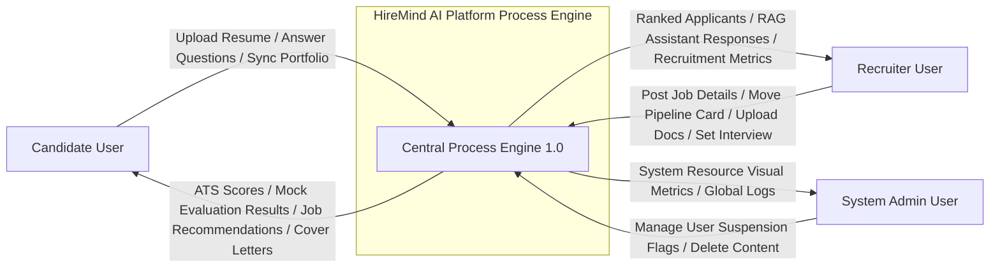
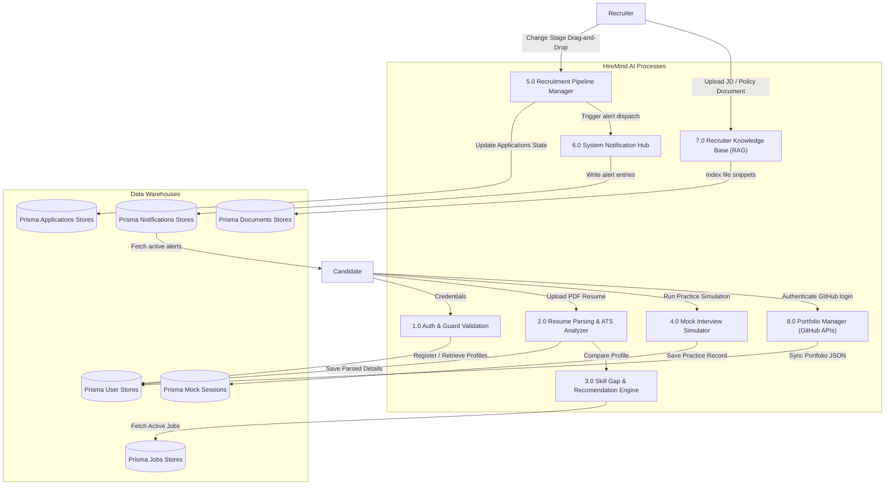
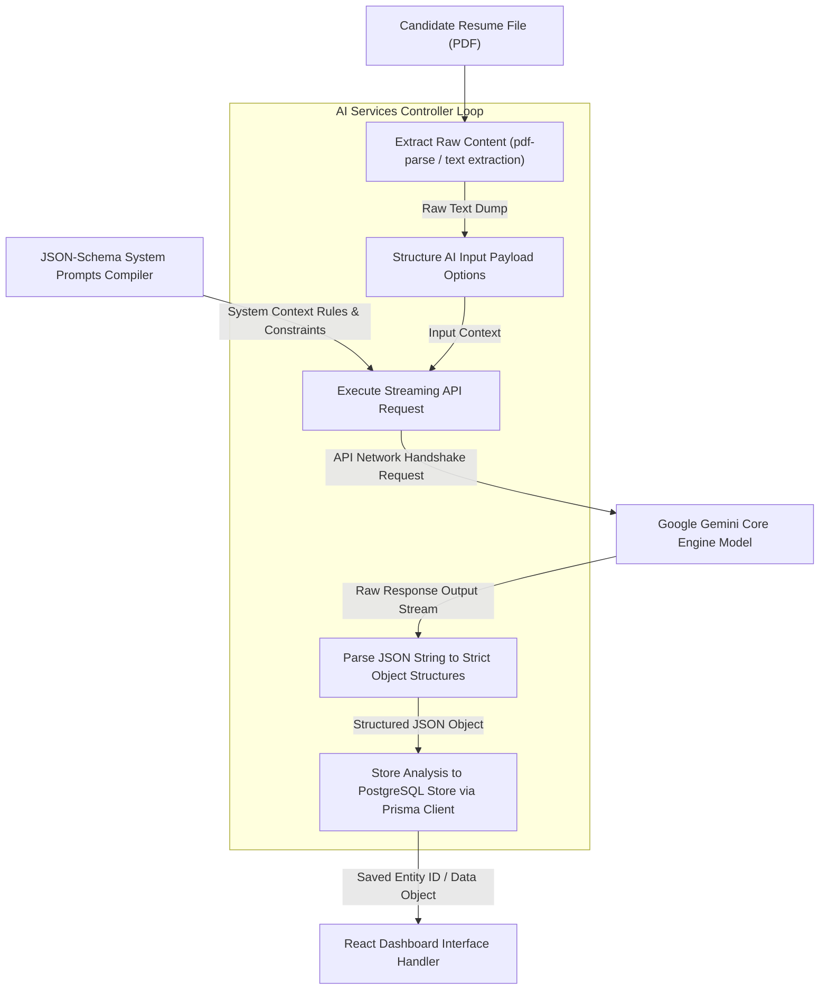
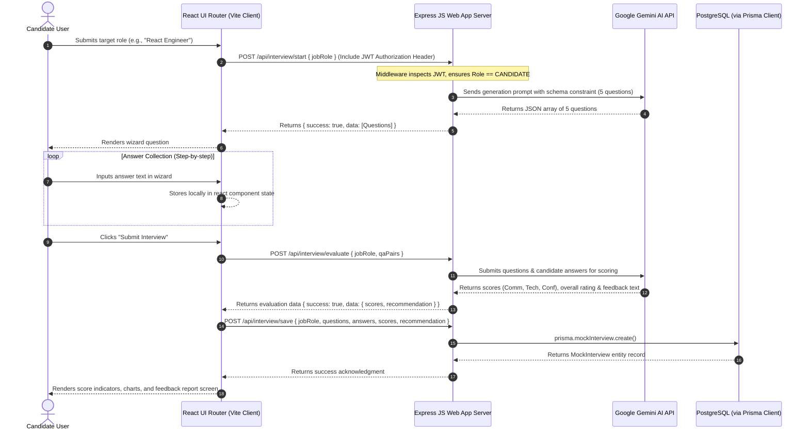
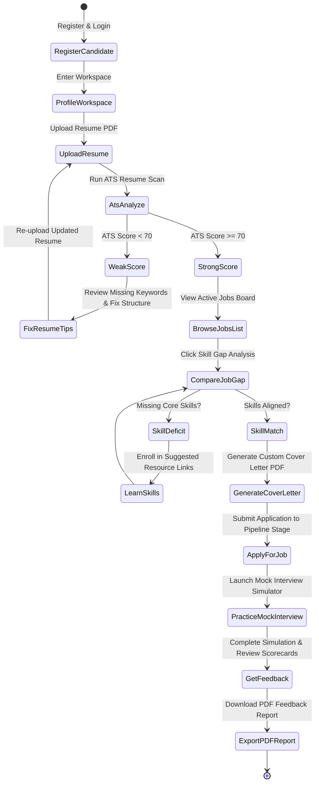

# Academic Documentation: HireMind AI Platform

This document serves as the comprehensive technical and academic documentation for the **HireMind AI** platform. It has been prepared to meet final-year MCA/university evaluation standards, covering system architecture, entity relationships, use cases, detailed data flow diagrams (DFD Levels 0, 1, and 2), system sequence flows, operational activity flows, deployment physical diagrams, database dictionaries, system test cases, and a comprehensive user manual.

---

## 1. System Architecture Diagram

The HireMind AI system employs a modern **Three-Tier Client-Server Architecture** coupled with external SaaS API service integration layers:

```mermaid
graph TD
    subgraph Client_Layer ["Client Presentation Layer (React + Tailwind CSS)"]
        A["Single Page Application (Vite/React)"]
        B["Auth Route Guards (JWT)"]
        C["UI Core Dashboard Component Controller"]
    end

    subgraph Controller_Layer ["Application & Controller Layer (Node.js + Express.js)"]
        D["Express Routing Engine"]
        E["Authentication Middleware (JWT verification & Role-based guards)"]
        F["Business Logic Controllers"]
        G["Prisma Client Engine Integration"]
    end

    subgraph Data_Storage_Layer ["Data Storage & Services Layer (PostgreSQL)"]
        H[("PostgreSQL Database Engine (Neon RDS Instance)")]
    end

    subgraph Service_Integrations ["External API Services Integration"]
        I["Google Gemini Pro 1.5 Flash AI Service (JSON-Schema Mode)"]
        J["Cloudinary Cloud Media Assets Upload Hosting"]
        K["GitHub GraphQL/REST Public Developer API Services"]
    end

    A -->|1. Route Render Request| B
    B -->|2. Secure Auth Verification| C
    C -->|3. API Request (HTTPS & Bearer JWT Token)| D
    D -->|4. Middleware Session Verification| E
    E -->|5. Hand-off Controller Call| F
    F -->|6. Query Executions| G
    G -->|7. Data Reads/Writes| H
    F -->|8. Analysis & Mock Interview Queries| I
    F -->|9. PDF/Resume Assets Storage| J
    C -->|10. Read Portfolio GitHub Statistics| K
```

---

## 2. Entity Relationship Diagram (ERD)

The database schema is mapped using **Prisma ORM** targeting **PostgreSQL**. The diagram represents all database entity definitions, primary/foreign keys, attributes, and cardinality constraints.



---

## 3. Use Case Diagram

The system supports three user actors: **Candidate**, **Recruiter**, and **Admin**.

```mermaid
graph TD
    subgraph Act ["System User Actors"]
        U_Cand["Candidate User"]
        U_Recr["Recruiter User"]
        U_Admin["Admin User"]
    end

    subgraph UC_Candidate ["Candidate Use Cases"]
        UC1["Upload & Parse Resume"]
        UC2["Analyze ATS Score Profile"]
        UC3["Analyze Job Skill Gap"]
        UC4["Run AI Mock Interview Session"]
        UC5["Export PDF Mock Report"]
        UC6["Sync GitHub Portfolio Widgets"]
        UC7["Bookmark / Save Job Cards"]
        UC8["Submit Job Application"]
    end

    subgraph UC_Recruiter ["Recruiter Use Cases"]
        UC9["Post / Close Jobs"]
        UC10["Manage Kanban Pipeline Stages"]
        UC11["Perform AI Applicant Ranking"]
        UC12["Schedule Candidates for Interviews"]
        UC13["Update Public Company Profile"]
        UC14["Query RAG Assistant Documents"]
    end

    subgraph UC_Admin ["Admin Use Cases"]
        UC15["Suspend / Activate User Accounts"]
        UC16["Delete Job Postings"]
        UC17["Track Platform Analytics KPIs"]
    end

    U_Cand --> UC1
    U_Cand --> UC2
    U_Cand --> UC3
    U_Cand --> UC4
    U_Cand --> UC5
    U_Cand --> UC6
    U_Cand --> UC7
    U_Cand --> UC8

    U_Recr --> UC9
    U_Recr --> UC10
    U_Recr --> UC11
    U_Recr --> UC12
    U_Recr --> UC13
    U_Recr --> UC14

    U_Admin --> UC15
    U_Admin --> UC16
    U_Admin --> UC17
```



---

## 4. Data Flow Diagrams (DFD)

### DFD Level 0 (Context Diagram)

The Level 0 context diagram shows the core information interfaces between the external actors and the boundary of the centralized HireMind AI Platform:



### DFD Level 1 (Process Breakdown Diagram)

The Level 1 diagram breaks the platform process boundary down into major sub-processes:



### DFD Level 2 (AI Services Internal Data Flow)

The Level 2 diagram displays the internal parsing, payload compilation, and formatting operations of the system's Gemini AI integration logic:



---

## 5. Sequence Diagram: AI Mock Interview Session

The sequence diagram documents the end-to-end interactions across React frontend, Express backend, Prisma ORM, Neon PostgreSQL, and the Gemini API during an AI Mock Interview:



---

## 6. Activity Diagram: Candidate Career Assessment Workflow

This workflow represents the control sequence mapping how candidates analyze their profile and improve matching:



---

## 7. Deployment Diagram

This physical deployment diagram maps the cloud architecture nodes housing the platform:

```mermaid
graph TD
    subgraph Client_Browser_Node ["User Device Context"]
        Browser["Web Browser (Chrome, Safari, Firefox, Edge)"]
        ReactApp["React Frontend Static Assets (HTML5, JS Bundle, Tailwind)"]
        Browser --> ReactApp
    end

    subgraph CDN_Edge_Nodes ["Static CDN hosting Edge network"]
        VercelCDN["Vercel Static Hosting Platform Server Nodes"]
    end

    subgraph Backend_App_Node ["Application Backend Node"]
        ExpressApp["Node.js / Express Web Server Running Environment"]
        PrismaORM["Prisma Database Connector Engine"]
        ExpressApp --> PrismaORM
    end

    subgraph Database_Cloud_Node ["Cloud Database Server Cluster"]
        PostgresNode[("Neon cloud hosted PostgreSQL Instance")]
    end

    subgraph Service_Cloud_Nodes ["External Third Party Services Cloud Nodes"]
        GeminiNodes["Google Cloud Gemini Pro Service Infrastructure"]
        CloudinaryNodes["Cloudinary Asset Storage Server Networks"]
    end

    ReactApp -->|Fetch/REST requests| VercelCDN
    ReactApp -->|API Calls (HTTPS / Port 443)| ExpressApp
    PrismaORM -->|Connection Pooling TCP/IP / Port 5432| PostgresNode
    ExpressApp -->|HTTPS / Port 443| GeminiNodes
    ExpressApp -->|HTTPS / Port 443| CloudinaryNodes
```

---

## 8. Data Dictionary

### 8.1. Table: User
Stores primary user identity records for authorization, authentication, and role allocation.

| Field Name | Data Type | Key Constraints | Default Value | Description |
| :--- | :--- | :--- | :--- | :--- |
| **id** | VARCHAR(36) | Primary Key (UUID) | Auto-generated | Unique identifier of the user record. |
| **fullName** | VARCHAR(255) | None | None | First name and last name of the user. |
| **email** | VARCHAR(255) | Unique Key | None | Electronic mail address (used for logging in). |
| **password** | VARCHAR(255) | None | None | Bcrypt-hashed password string. |
| **role** | ENUM("ADMIN", "RECRUITER", "CANDIDATE") | None | None | Role assigned for role-based permission gates. |
| **isSuspended** | BOOLEAN | None | FALSE | Flag to suspend users. If TRUE, JWT auth calls reject logins. |
| **createdAt** | TIMESTAMP | None | NOW() | Date-time stamp when the profile was generated. |

### 8.2. Table: CandidateProfile
Holds metadata specific to job seekers, including parsed resume attributes and career indicators.

| Field Name | Data Type | Key Constraints | Default Value | Description |
| :--- | :--- | :--- | :--- | :--- |
| **id** | VARCHAR(36) | Primary Key (UUID) | Auto-generated | Unique identifier for candidate meta. |
| **userId** | VARCHAR(36) | Foreign Key (Ref User.id) | None | Maps CandidateProfile back to User. |
| **skills** | VARCHAR(255)[] | Array Field | None | Array of parsed skill strings. |
| **education** | TEXT | None | None | Educational history (text paragraph). |
| **experience** | TEXT | None | None | Professional experience history details. |
| **resumeUrl** | VARCHAR(2048) | None | None | File path URI to current active resume file in Cloudinary. |
| **professionalSummary** | TEXT | None | None | Short bio or overview. |
| **strengths** | VARCHAR(255)[] | Array Field | None | AI-analyzed candidate strengths list. |
| **weaknesses** | VARCHAR(255)[] | Array Field | None | AI-analyzed candidate skill deficits list. |
| **hiringRecommendation** | TEXT | None | None | Overall suitability overview from ATS. |
| **linkedinUrl** | VARCHAR(2048) | None | None | Profile link. |
| **githubUrl** | VARCHAR(2048) | None | None | Profile link. |
| **portfolioUrl** | VARCHAR(2048) | None | None | Profile link. |
| **profileImage** | VARCHAR(2048) | None | None | Link to avatar image resource. |
| **certifications** | VARCHAR(255)[] | Array Field | None | Array of certification strings. |
| **resumeHistory** | JSON | JSON Field | None | Array of previously uploaded resume links for archiving. |
| **createdAt** | TIMESTAMP | None | NOW() | Date profile details were created. |

### 8.3. Table: RecruiterProfile
Stores company affiliation information for recruiter users.

| Field Name | Data Type | Key Constraints | Default Value | Description |
| :--- | :--- | :--- | :--- | :--- |
| **id** | VARCHAR(36) | Primary Key (UUID) | Auto-generated | Unique identifier for recruiter profile. |
| **userId** | VARCHAR(36) | Foreign Key (Ref User.id) | None | Mapped to parent user record. |
| **companyName** | VARCHAR(255) | None | None | Name of the primary organization. |
| **companyLogo** | VARCHAR(2048) | None | None | URI to image asset. |
| **companyWebsite** | VARCHAR(2048) | None | None | Web URL. |
| **companyDescription** | TEXT | None | None | Summary of company services. |
| **industry** | VARCHAR(255) | None | None | Industry category tag (e.g. Fintech). |
| **companySize** | VARCHAR(50) | None | None | Staff count band. |
| **createdAt** | TIMESTAMP | None | NOW() | Profile creation date. |

### 8.4. Table: Job
Details active recruitment openings created by recruiters.

| Field Name | Data Type | Key Constraints | Default Value | Description |
| :--- | :--- | :--- | :--- | :--- |
| **id** | VARCHAR(36) | Primary Key (UUID) | Auto-generated | Unique ID for the job opening. |
| **title** | VARCHAR(255) | None | None | Job role title (e.g. Software Architect). |
| **description** | TEXT | None | None | Complete requirements write-up. |
| **location** | VARCHAR(255) | None | None | Work location (e.g., Remote, hybrid). |
| **salary** | VARCHAR(100) | None | None | Salary budget (e.g., "$120k - $140k"). |
| **jobType** | ENUM("FULL_TIME", "PART_TIME", "INTERNSHIP", "CONTRACT") | None | None | Standard employment structure classification. |
| **skillsRequired** | VARCHAR(255)[] | Array Field | None | Array of required skill keyword tags. |
| **status** | VARCHAR(50) | None | "OPEN" | Job status indicator ("OPEN", "PAUSED", "CLOSED"). |
| **recruiterId** | VARCHAR(36) | Foreign Key (Ref User.id) | None | Maps to the recruiter user who posted it. |
| **createdAt** | TIMESTAMP | None | NOW() | Date-time stamp when job was posted. |

### 8.5. Table: Application
Captures job-seeker applications to jobs, including pipeline tracker stages and interview schedules.

| Field Name | Data Type | Key Constraints | Default Value | Description |
| :--- | :--- | :--- | :--- | :--- |
| **id** | VARCHAR(36) | Primary Key (UUID) | Auto-generated | Unique application record identifier. |
| **candidateId** | VARCHAR(36) | Foreign Key (Ref User.id) | None | Maps to candidate user applicant. |
| **jobId** | VARCHAR(36) | Foreign Key (Ref Job.id) | None | Mapped to target job posting. |
| **matchScore** | DOUBLE PRECISION | None | None | Fit percentage calculated by Gemini AI. |
| **aiFeedback** | TEXT | None | None | Text explanation of suitability generated by AI. |
| **status** | VARCHAR(50) | None | "APPLIED" | Main application status. |
| **pipelineStage** | VARCHAR(50) | None | "Applied" | Kanban board stage ("Applied", "Reviewing", "Shortlisted", "Interview", "Selected", "Rejected"). |
| **interviewDate** | TIMESTAMP | None | None | Scheduled calendar date for interview. |
| **interviewTime** | VARCHAR(50) | None | None | Scheduled calendar time for interview. |
| **interviewLink** | VARCHAR(2048) | None | None | Video conference link (e.g., Zoom/Google Meet). |
| **interviewerNotes** | TEXT | None | None | Internal preparation notes for recruiter. |
| **recruiterNotes** | TEXT | None | None | Additional notes/feedback from recruiters. |
| **createdAt** | TIMESTAMP | None | NOW() | Application submission date. |

### 8.6. Table: MockInterview
Saves simulation feedback parameters for candidate mock interview practices.

| Field Name | Data Type | Key Constraints | Default Value | Description |
| :--- | :--- | :--- | :--- | :--- |
| **id** | VARCHAR(191) | Primary Key (CUID) | Auto-generated | CUID format interview record identifier. |
| **candidateId** | VARCHAR(36) | Foreign Key (Ref User.id) | None | Mapped to candidate practicing. |
| **jobRole** | VARCHAR(255) | None | None | Job role evaluated (e.g., Python Developer). |
| **questions** | JSON | None | None | Array of questions asked. |
| **answers** | JSON | None | None | Array of text answers submitted by user. |
| **communicationScore**| INT | None | None | Communication assessment score (0 - 100). |
| **technicalScore** | INT | None | None | Technical competency score (0 - 100). |
| **confidenceScore** | INT | None | None | Overall confidence score (0 - 100). |
| **overallRating** | VARCHAR(100) | None | None | General band rating (e.g., "Advanced"). |
| **recommendation** | TEXT | None | None | Gemini-generated actionable feedback paragraph. |
| **createdAt** | TIMESTAMP | None | NOW() | Date-time stamp of mock session. |

### 8.7. Table: SavedJob
Stores bookmarks for candidates who save active jobs to view later.

| Field Name | Data Type | Key Constraints | Default Value | Description |
| :--- | :--- | :--- | :--- | :--- |
| **id** | VARCHAR(36) | Primary Key (UUID) | Auto-generated | Bookmark ID record. |
| **candidateId** | VARCHAR(36) | Foreign Key (Ref User.id) | None | Mapped to candidate saving the job. |
| **jobId** | VARCHAR(36) | Foreign Key (Ref Job.id) | None | Target job being bookmarked. |
| **createdAt** | TIMESTAMP | None | NOW() | Timestamp when job was saved. |

### 8.8. Table: Notification
Manages alert tracking for dispatch to active user dashboards.

| Field Name | Data Type | Key Constraints | Default Value | Description |
| :--- | :--- | :--- | :--- | :--- |
| **id** | VARCHAR(36) | Primary Key (UUID) | Auto-generated | Notification record ID. |
| **userId** | VARCHAR(36) | Foreign Key (Ref User.id) | None | Mapped to target recipient user. |
| **title** | VARCHAR(255) | None | None | Short category header (e.g., Interview Scheduled). |
| **message** | TEXT | None | None | Detailed notification content. |
| **isRead** | BOOLEAN | None | FALSE | Read/unread toggle. |
| **createdAt** | TIMESTAMP | None | NOW() | Dispatched timestamp. |

### 8.9. Table: CompanyDocument
RAG resources scanned for recruiters to query job specifications or employee handbooks.

| Field Name | Data Type | Key Constraints | Default Value | Description |
| :--- | :--- | :--- | :--- | :--- |
| **id** | VARCHAR(36) | Primary Key (UUID) | Auto-generated | Document ID record. |
| **title** | VARCHAR(255) | None | None | Filename or document title. |
| **content** | TEXT | None | None | Indexed text content parsed from files. |
| **category** | VARCHAR(50) | None | "GENERAL" | Category tag ("JD", "POLICY", "GUIDELINE", "GENERAL"). |
| **recruiterId** | VARCHAR(36) | Foreign Key (Ref User.id) | None | Creator recruiter user. |
| **createdAt** | TIMESTAMP | None | NOW() | Date indexed. |

### 8.10. Table: CompanyProfile
Stores customizable organizational parameters displayed on public candidate-facing company details pages.

| Field Name | Data Type | Key Constraints | Default Value | Description |
| :--- | :--- | :--- | :--- | :--- |
| **id** | VARCHAR(191) | Primary Key (CUID) | Auto-generated | Company Profile unique CUID string. |
| **recruiterId** | VARCHAR(36) | Foreign Key (Ref User.id) | None | Recruiter who owns company settings. |
| **companyName** | VARCHAR(255) | None | None | Registered business name. |
| **logo** | VARCHAR(2048) | None | None | Logo link URL. |
| **website** | VARCHAR(2048) | None | None | Link URL. |
| **industry** | VARCHAR(255) | None | None | Organization market category. |
| **teamSize** | VARCHAR(100) | None | None | Size category band. |
| **about** | TEXT | None | None | Core business operations description summary. |
| **location** | VARCHAR(255) | None | None | Geographical headquarters location. |
| **founded** | VARCHAR(50) | None | None | Organization founding year (e.g., 2012). |

### 8.11. Table: CandidatePortfolio
Stores information about developer integrations, GitHub details, achievements, and cert projects.

| Field Name | Data Type | Key Constraints | Default Value | Description |
| :--- | :--- | :--- | :--- | :--- |
| **id** | VARCHAR(191) | Primary Key (CUID) | Auto-generated | Portfolio record CUID string identifier. |
| **candidateId** | VARCHAR(36) | Foreign Key (Ref User.id) | None | Target candidate owner. |
| **githubUrl** | VARCHAR(2048) | None | None | Profile URL. |
| **linkedinUrl** | VARCHAR(2048) | None | None | Profile URL. |
| **portfolioUrl** | VARCHAR(2048) | None | None | Personal developer website. |
| **projects** | JSON | None | None | List of custom developer project records. |
| **certifications** | JSON | None | None | Mapped certifications array content. |
| **achievements** | JSON | None | None | Written list of milestones / accomplishments. |

---

## 9. Comprehensive Testing Document

The following suites represent verification actions verifying full-stack operational logic across the platform.

### 9.1. Test Suite: User Authentication & Guard Security

| Test ID | Test Scope / Target | Action Inputs | Expected Results | Actual Results | Status |
| :--- | :--- | :--- | :--- | :--- | :--- |
| **TC-SEC-01** | Account Registration | POST `/api/auth/register` with new email, password, role="CANDIDATE" | User created, Bcrypt hashed password, returns JWT token with `success: true`. | JSON success response with valid candidate token structure. | **PASS** |
| **TC-SEC-02** | Email Uniqueness Guard | POST `/api/auth/register` using already registered email | Rejects creation, returns `400 Bad Request` explaining user already exists. | Correctly responds with "Email already in use" status message. | **PASS** |
| **TC-SEC-03** | Suspended Account Login Lockout | POST `/api/auth/login` for user with flag `isSuspended: true` | Rejects access token generation, returns `403 Forbidden` for suspended access. | Correctly outputs "Your account has been suspended" error structure. | **PASS** |
| **TC-SEC-04** | Role-Based Access Guard | GET `/api/admin/users` called with standard CANDIDATE JWT token header | Blocks access, returns `403 Forbidden` due to insufficient roles. | Returns "Access Denied: Admin authorization required" JSON signature. | **PASS** |

### 9.2. Test Suite: AI Resume Scanning & Gap Analysis

| Test ID | Test Scope / Target | Action Inputs | Expected Results | Actual Results | Status |
| :--- | :--- | :--- | :--- | :--- | :--- |
| **TC-AI-01**  | ATS Analysis Payload | POST `/api/ats/analyze` with parsed resume text content | Returns JSON with scores (Skills, Formats, Keywords, Projects) and suggestions. | Valid structured JSON containing circular chart score components. | **PASS** |
| **TC-AI-02**  | Skill Gap Comparison | POST `/api/skills/gap-analysis` comparing resume against active job JDs | Generates matched skills lists, missing skills, and learning resource links. | Outputs resource URLs alongside arrays of matched/missing tags. | **PASS** |
| **TC-AI-03**  | AI Cover Letter Generator | POST `/api/candidate/cover-letter` with JD body and candidate resume | Returns formal letter matching tone, including placeholders for applicant names. | Generates letter, allowing UI widgets to copy and download PDF cleanly. | **PASS** |

### 9.3. Test Suite: AI Mock Interview Simulator & Reports

| Test ID | Test Scope / Target | Action Inputs | Expected Results | Actual Results | Status |
| :--- | :--- | :--- | :--- | :--- | :--- |
| **TC-MOCK-01**| Interview Start Loop | POST `/api/interview/start` for "DevOps Engineer" role | Generates array containing 5 role-relevant interview questions. | Returns 5 DevOps questions (technical & behavioral mix) in JSON. | **PASS** |
| **TC-MOCK-02**| Practice Evaluation | POST `/api/interview/evaluate` with questions and mock candidate answers | Gemini generates score indices (Communication, Tech, Conf) out of 100. | Returns integers for scores and text recommendation block. | **PASS** |
| **TC-MOCK-03**| Database Log Save | POST `/api/interview/save` with session parameters | Stores session to PostgreSQL, returning created MockInterview entity object. | Prisma commits record correctly. | **PASS** |
| **TC-MOCK-04**| Export PDF Report | Click "Download PDF Report" in React Mock Interview history | Generates and downloads PDF with scores, comments, questions & answers. | PDF generated dynamically via jsPDF download. | **PASS** |

### 9.4. Test Suite: Recruiter Pipeline & Kanban Board

| Test ID | Test Scope / Target | Action Inputs | Expected Results | Actual Results | Status |
| :--- | :--- | :--- | :--- | :--- | :--- |
| **TC-REC-01** | AI Applicant Ranking | POST `/api/recruiter/rank-candidates` for a specific jobId | Ranks applicants by calculated match score, summarizing key strengths/concerns. | Lists candidates sorted by descending percentage matches. | **PASS** |
| **TC-REC-02** | Kanban Move Event | PATCH `/api/recruiter/pipeline/move` with applicationId, newStage="Interview" | Updates `pipelineStage` in database; creates automatic notification. | DB changes stage; target candidate receives bell notification. | **PASS** |
| **TC-REC-03** | RAG Document Sync | POST `/api/ai/upload-document` with company guideline PDF text | Content indexed into database under `CompanyDocument` table model. | Document saved; instantly queryable in Recruiter AI chat window. | **PASS** |

---

## 10. Operational User Manual

This manual explains how to interact with the platform as a Candidate, Recruiter, and Admin.

### 10.1. Candidate Workflow Guide

#### Step 1: Account Setup & Resume Analysis
1. Register an account under the **Candidate** role and log in.
2. Navigate to the **Dashboard** and locate the **Resume Workspace**.
3. Upload your current resume in PDF format.
4. Once parsed, click **ATS Optimizer** in the navigation bar. You will view:
   * Your overall ATS matching score.
   * Specific feedback breakdown categories (Formatting, Skills, Keywords, Experience).
   * Key recommendations and missing keywords to insert into your resume.

#### Step 2: Job Search & Skill Gap Analysis
1. Navigate to the **Browse Jobs** page.
2. Filter jobs by Location, Salary, or required Skills.
3. Click on any job card to view the detailed requirements popup.
4. Select the **AI Skill Gap** tab. Here, Gemini will match your skills against the job description and recommend specific courses or tutorial links for missing tools.
5. If interested, click **AI Cover Letter** to generate a custom-tailored cover letter based on your resume. You can copy the generated text or download it directly as a PDF report.
6. Bookmarks are toggled by clicking the **Bookmark / Save Job** button. You can view all saved jobs on the **Saved Jobs** route.

#### Step 3: Practicing with AI Mock Interviews
1. Navigate to **Mock Interview** via the Navbar.
2. Enter your desired job title (e.g., "Fullstack React Developer") and click **Start Interview**.
3. The system generates 5 questions. Input your answer in the text box for each question, using the **Next** and **Previous** buttons to navigate.
4. Click **Submit Interview** on the final question.
5. The system will evaluate your communication clarity, technical depth, and confidence level, outputting scores and feedback.
6. Click **Download PDF Report** to save a detailed, print-friendly PDF of your performance.

---

### 10.2. Recruiter Workflow Guide

#### Step 1: Manage Jobs & Company Profile
1. Log in with a **Recruiter** account.
2. Navigate to **Company Profile** in the Navbar to configure public-facing profile parameters (logo, description, industry, founded year). Candidates will see this profile when clicking on your job postings.
3. On the dashboard, click **Post Job** to create new openings, detailing titles, description paragraphs, locations, salaries, and required skills.

#### Step 2: Screen Applicants using AI & Kanban Pipelines
1. From your dashboard, click **View Applicants** on any active job.
2. Toggle the **AI Ranking** switch. The list will sort candidates dynamically by their match score and highlight their key strengths and weaknesses.
3. Click the **Pipeline Kanban** button to view the application stages board.
4. Drag applicant cards across columns (Applied, Reviewing, Shortlisted, Interview, Selected, Rejected) to update their status.
5. Double-click an applicant card to open the **Interview Scheduler** modal. Specify dates, meeting URLs, and instructions. Moving candidates or scheduling interviews triggers in-app alerts for them.

#### Step 3: Recruiting Knowledge Base (RAG Assistant)
1. Use the **RAG Knowledge Assistant** section on your dashboard.
2. Upload company handbooks, benefit guides, or specialized job specs.
3. Type questions into the chat box (e.g., "What is our company policy on remote work stipends?"). The system queries the uploaded files and Gemini answers using only that document context.

---

### 10.3. Admin Control Center Guide

1. Log in with an **Admin** account.
2. Access the **Admin Panel** from the navigation bar.
3. Review total counts of candidates, recruiters, active jobs, and system-wide metrics.
4. View the user management table:
   * Search for users by email.
   * Click **Suspend** to restrict user logins (suspended users are denied API requests).
   * Click **Activate** to lift suspensions.
5. View the jobs management table to monitor and delete inappropriate job postings.
